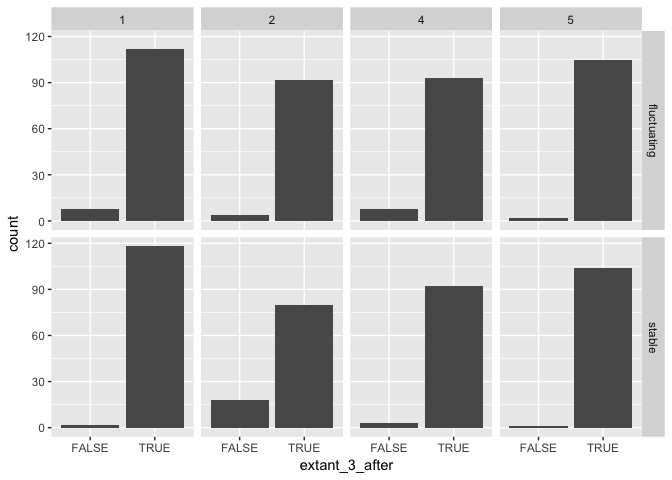
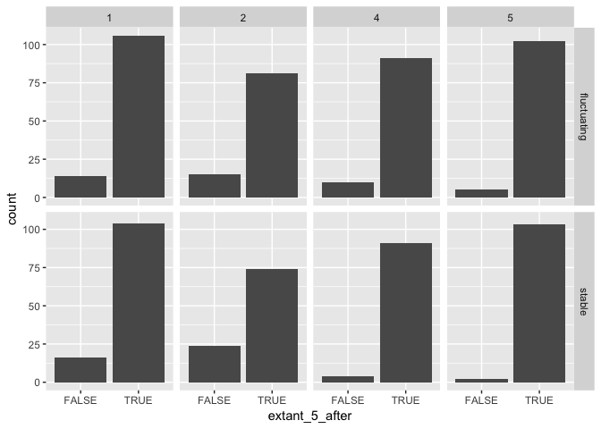
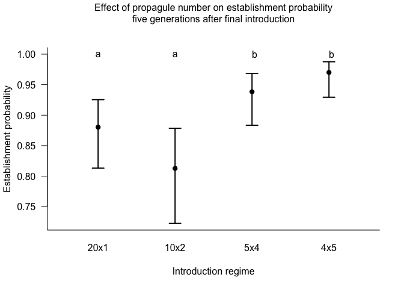
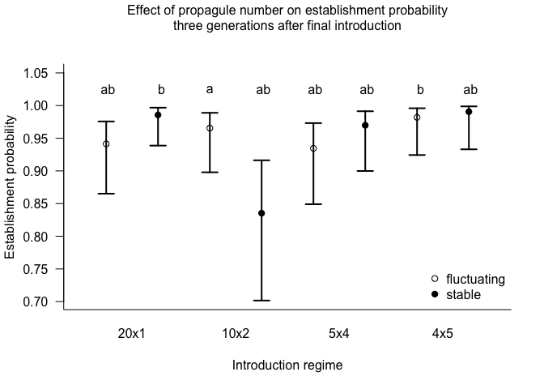
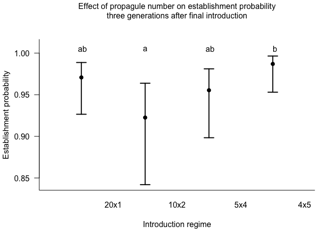
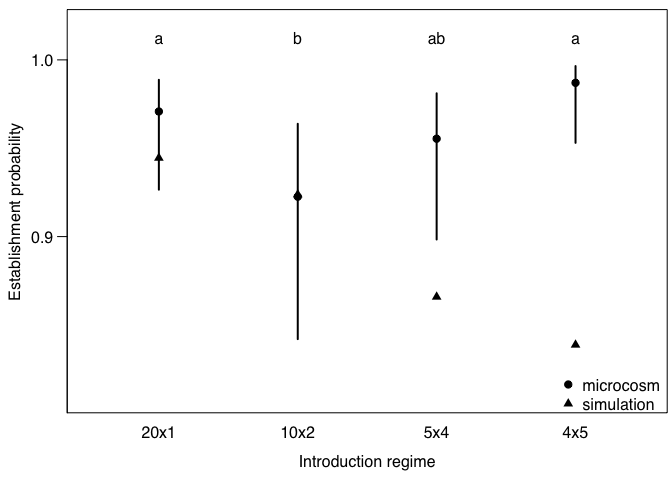

Establishment probability relative time
================
Michael Koontz
2/26/2018

# Purpose

A quick outline of the establishment probability analysis when using a
relative amount of time since the final introduction event.

``` r
library(car)
library(ggplot2)
library(lme4)
```

    ## Loading required package: Matrix

``` r
library(lsmeans)
```

    ## The 'lsmeans' package is being deprecated.
    ## Users are encouraged to switch to 'emmeans'.
    ## See help('transition') for more information, including how
    ## to convert 'lsmeans' objects and scripts to work with 'emmeans'.

``` r
library(multcompView)
library(tidyr)
```

    ## 
    ## Attaching package: 'tidyr'

    ## The following object is masked from 'package:Matrix':
    ## 
    ##     expand

``` r
library(dplyr)
```

    ## 
    ## Attaching package: 'dplyr'

    ## The following object is masked from 'package:car':
    ## 
    ##     recode

    ## The following objects are masked from 'package:stats':
    ## 
    ##     filter, lag

    ## The following objects are masked from 'package:base':
    ## 
    ##     intersect, setdiff, setequal, union

``` r
library(here)
```

    ## here() starts at /Users/mikoontz/dev/manuscripts/ppp-establishment

``` r
b <- read.csv(here::here("/data/clean-establishment-data.csv"))
b$number <- as.factor(b$number)
b$block <- as.factor(b$block)
b$gap <- as.factor(b$gap)
```

Don’t bother assessing the effect of the introduction gap, just filter
out those populations

``` r
b <-
  b %>% 
  filter(gap == FALSE)

glimpse(b)
```

    ## Observations: 842
    ## Variables: 42
    ## $ ID               <int> 1, 2, 3, 4, 5, 6, 7, 8, 9, 10, 11, 12, 13, 14...
    ## $ block            <fct> 1, 1, 1, 1, 1, 1, 1, 1, 1, 1, 1, 1, 1, 1, 1, ...
    ## $ color            <fct> blue, blue, blue, blue, blue, blue, blue, blu...
    ## $ number           <fct> 1, 1, 1, 1, 1, 1, 1, 1, 1, 1, 1, 1, 1, 1, 1, ...
    ## $ size             <int> 20, 20, 20, 20, 20, 20, 20, 20, 20, 20, 20, 2...
    ## $ environment      <fct> fluctuating, fluctuating, fluctuating, fluctu...
    ## $ special          <lgl> FALSE, FALSE, FALSE, FALSE, FALSE, FALSE, FAL...
    ## $ gap              <fct> FALSE, FALSE, FALSE, FALSE, FALSE, FALSE, FAL...
    ## $ notes            <fct> , , , , , , , , , , , , , , , , , , , , , , , , 
    ## $ drought          <lgl> FALSE, FALSE, FALSE, TRUE, FALSE, TRUE, FALSE...
    ## $ N0plus1          <int> 8, 15, 10, 12, 8, 22, 16, 19, 14, 16, 16, 20,...
    ## $ N1plus1          <int> 19, 29, 16, 29, 17, 15, 49, 17, 27, 33, 48, 6...
    ## $ N2plus1          <int> 29, 14, 28, 33, 25, 28, 21, 7, 13, 50, 48, 51...
    ## $ N3plus1          <int> 36, 8, 10, 26, 21, 34, 27, 2, 17, 24, 44, 25,...
    ## $ N4plus1          <int> 40, 17, 4, 51, 37, 35, 19, 10, 7, 40, 63, 41,...
    ## $ N5plus1          <int> 79, 4, NA, 117, 44, 83, 40, 16, 29, 57, 90, 4...
    ## $ N6plus1          <int> 89, 8, NA, 44, 43, 55, 52, 14, 34, 76, 42, 51...
    ## $ N7plus1          <int> 29, 3, NA, 31, 22, 27, 52, 11, 16, 42, 26, 35...
    ## $ N8plus1          <int> 37, 9, NA, 47, 26, 31, 29, 19, 17, 20, 25, 30...
    ## $ N9plus1          <int> 34, 17, NA, 28, 24, 22, 25, 10, 19, 15, 38, 1...
    ## $ temp.extinctions <int> 0, 0, 0, 0, 0, 0, 0, 0, 0, 0, 0, 0, 0, 0, 0, ...
    ## $ loss             <int> 0, 0, 0, 0, 0, 0, 0, 0, 0, 0, 0, 0, 0, 0, 0, ...
    ## $ when.extinct     <int> NA, NA, 6, NA, NA, NA, NA, NA, NA, NA, NA, NA...
    ## $ extant1          <lgl> TRUE, TRUE, TRUE, TRUE, TRUE, TRUE, TRUE, TRU...
    ## $ extant2          <lgl> TRUE, TRUE, TRUE, TRUE, TRUE, TRUE, TRUE, TRU...
    ## $ extant3          <lgl> TRUE, TRUE, TRUE, TRUE, TRUE, TRUE, TRUE, TRU...
    ## $ extant4          <lgl> TRUE, TRUE, TRUE, TRUE, TRUE, TRUE, TRUE, TRU...
    ## $ extant5          <lgl> TRUE, TRUE, TRUE, TRUE, TRUE, TRUE, TRUE, TRU...
    ## $ extant6          <lgl> TRUE, TRUE, FALSE, TRUE, TRUE, TRUE, TRUE, TR...
    ## $ extant7          <lgl> TRUE, TRUE, FALSE, TRUE, TRUE, TRUE, TRUE, TR...
    ## $ extant8          <lgl> TRUE, TRUE, FALSE, TRUE, TRUE, TRUE, TRUE, TR...
    ## $ extant9          <lgl> TRUE, TRUE, FALSE, TRUE, TRUE, TRUE, TRUE, TR...
    ## $ extant_1_after   <lgl> TRUE, TRUE, TRUE, TRUE, TRUE, TRUE, TRUE, TRU...
    ## $ extant_2_after   <lgl> TRUE, TRUE, TRUE, TRUE, TRUE, TRUE, TRUE, TRU...
    ## $ extant_3_after   <lgl> TRUE, TRUE, TRUE, TRUE, TRUE, TRUE, TRUE, TRU...
    ## $ extant_4_after   <lgl> TRUE, TRUE, TRUE, TRUE, TRUE, TRUE, TRUE, TRU...
    ## $ extant_5_after   <lgl> TRUE, TRUE, TRUE, TRUE, TRUE, TRUE, TRUE, TRU...
    ## $ N_1_after        <int> 8, 15, 10, 12, 8, 22, 16, 19, 14, 16, 16, 20,...
    ## $ N_2_after        <int> 19, 29, 16, 29, 17, 15, 49, 17, 27, 33, 48, 6...
    ## $ N_3_after        <int> 29, 14, 28, 33, 25, 28, 21, 7, 13, 50, 48, 51...
    ## $ N_4_after        <int> 36, 8, 10, 26, 21, 34, 27, 2, 17, 24, 44, 25,...
    ## $ N_5_after        <int> 40, 17, 4, 51, 37, 35, 19, 10, 7, 40, 63, 41,...

# Exploratory data analysis plot

Visualize how many populations were extant 3 generations after their
final introduction event would get us up to Generation 7 (as we reported
in the paper). Looking 5 generations is as far as we can look, given the
limits of our data collection.

``` r
ggplot(b, aes(x = extant_3_after)) +
  geom_histogram(stat = "count") +
  facet_grid(environment ~ number)
```

    ## Warning: Ignoring unknown parameters: binwidth, bins, pad

<!-- -->

``` r
ggplot(b, aes(x = extant_5_after)) +
  geom_histogram(stat = "count") +
  facet_grid(environment ~ number)
```

    ## Warning: Ignoring unknown parameters: binwidth, bins, pad

<!-- -->

# Build some models

We will use a simple random effects structure with temporal block as a
random intercept
effect

## Five generations after the final introduction event. This uses data all the way up through generation 9 (for the 4x5 intro regime, generation 9 represents 5 generations after the final introduction event)

``` r
# Use LRT tests to guide interpretation, but all fixed effects will remain in the model in the end
m_5after_1 <- glmer(extant_5_after ~ number*environment + (1 | block), data=b, family=binomial, control=glmerControl(optimizer="bobyqa"))

m_5after_2 <- update(m_5after_1, formula= .~. - number:environment)

anova(m_5after_1, m_5after_2)
```

    ## Data: b
    ## Models:
    ## m_5after_2: extant_5_after ~ number + environment + (1 | block)
    ## m_5after_1: extant_5_after ~ number * environment + (1 | block)
    ##            Df    AIC    BIC  logLik deviance  Chisq Chi Df Pr(>Chisq)
    ## m_5after_2  6 545.46 573.88 -266.73   533.46                         
    ## m_5after_1  9 545.62 588.24 -263.81   527.62 5.8463      3     0.1193

We fail to reject the null hypothesis that the model with the
`number*environment` interaction equally as likely than the model
without it, so we proceed by simplifying the model and dropping the
interaction term.

``` r
m_5after_3 <- update(m_5after_2, formula= .~. -environment)

anova(m_5after_3, m_5after_2)
```

    ## Data: b
    ## Models:
    ## m_5after_3: extant_5_after ~ number + (1 | block)
    ## m_5after_2: extant_5_after ~ number + environment + (1 | block)
    ##            Df    AIC    BIC  logLik deviance  Chisq Chi Df Pr(>Chisq)
    ## m_5after_3  5 543.56 567.24 -266.78   533.56                         
    ## m_5after_2  6 545.46 573.88 -266.73   533.46 0.0998      1      0.752

We fail to reject the null hypothesis that the model with the
`environment` predictor is equally as likely as the model without it, so
we infer that it may not be an important predictor.

``` r
m_5after_4 <- update(m_5after_3, formula= .~. -number)

anova(m_5after_4, m_5after_3)
```

    ## Data: b
    ## Models:
    ## m_5after_4: extant_5_after ~ (1 | block)
    ## m_5after_3: extant_5_after ~ number + (1 | block)
    ##            Df    AIC    BIC  logLik deviance  Chisq Chi Df Pr(>Chisq)    
    ## m_5after_4  2 569.51 578.98 -282.75   565.51                             
    ## m_5after_3  5 543.56 567.24 -266.78   533.56 31.945      3  5.376e-07 ***
    ## ---
    ## Signif. codes:  0 '***' 0.001 '**' 0.01 '*' 0.05 '.' 0.1 ' ' 1

We reject the null hypothesis that the model with the `number` predictor
is equally as likely as the model without it, so that must be an
important predictor and we focus our interpretation there.

Another way to look at group-level effects like we did with likelihood
ratio tests is using a Type II Wald \(\chi^2\) test. I think this test
is somewhat anti-conservative, but it gives us a good ballpark and
corroborates the results from our Likelihood Ratio Test.

``` r
Anova(m_5after_1)
```

    ## Analysis of Deviance Table (Type II Wald chisquare tests)
    ## 
    ## Response: extant_5_after
    ##                      Chisq Df Pr(>Chisq)    
    ## number             23.1706  3  3.721e-05 ***
    ## environment         0.1611  1     0.6882    
    ## number:environment  5.4934  3     0.1390    
    ## ---
    ## Signif. codes:  0 '***' 0.001 '**' 0.01 '*' 0.05 '.' 0.1 ' ' 1

We’ll average across the environment treatments and focus on the
introduction regime
treatments.

``` r
# The final model which includes all fixed effects and uses the trimmed dataset without populations that experienced a gap in the introduction period
final_5after <- m_5after_1

results_5after <- lsmeans::lsmeans(final_5after, pairwise ~ number, adjust="none")
```

    ## NOTE: Results may be misleading due to involvement in interactions

``` r
results_5after
```

    ## $lsmeans
    ##  number   lsmean        SE df asymp.LCL asymp.UCL
    ##  1      1.994914 0.2675721 NA 1.4704821  2.519345
    ##  2      1.468043 0.2600640 NA 0.9583266  1.977759
    ##  4      2.722816 0.3558023 NA 2.0254561  3.420175
    ##  5      3.476728 0.4596382 NA 2.5758537  4.377603
    ## 
    ## Results are averaged over the levels of: environment 
    ## Results are given on the logit (not the response) scale. 
    ## Confidence level used: 0.95 
    ## 
    ## $contrasts
    ##  contrast   estimate        SE df z.ratio p.value
    ##  1 - 2     0.5268710 0.2695757 NA   1.954  0.0506
    ##  1 - 4    -0.7279021 0.3626413 NA  -2.007  0.0447
    ##  1 - 5    -1.4818144 0.4668754 NA  -3.174  0.0015
    ##  2 - 4    -1.2547730 0.3562173 NA  -3.522  0.0004
    ##  2 - 5    -2.0086854 0.4624345 NA  -4.344  <.0001
    ##  4 - 5    -0.7539124 0.5219044 NA  -1.445  0.1486
    ## 
    ## Results are averaged over the levels of: environment 
    ## Results are given on the log odds ratio (not the response) scale.

``` r
posthoc_5after <- summary(results_5after$lsmeans)

sig_letters_5after <- lsmeans::cld(results_5after, Letters = letters, adjust = "none")$.group[order(cld(results_5after)$number)]
xvals_5after <- 1:length(posthoc_5after$lsmean)
min_y_5after <- min(plogis(posthoc_5after$asymp.LCL))

plot(x = xvals_5after, y=plogis(posthoc_5after$lsmean), 
     ylim=c(min_y_5after, 1.0), 
     xlim = range(xvals_5after) + c(-0.5, 0.5), 
     las=1, 
     pch=19, 
     xaxt="n", 
     xlab="Introduction regime", 
     ylab="Establishment probability",
     bty="L")

axis(side=1, 
     at = xvals_5after, 
     labels = c("20x1","10x2","5x4","4x5"), 
     tick = FALSE)

arrows(x0 = xvals_5after, 
       y0 = plogis(posthoc_5after$asymp.LCL), 
       y1 = plogis(posthoc_5after$asymp.UCL), 
       code = 3, 
       length = 0.1, 
       angle = 90, 
       lwd = 2)

text(x = 1:4, y = 1.0, labels = sig_letters_5after)

mtext(side=3, 
      text="Effect of propagule number on establishment probability\nfive generations after final introduction", 
      line = 2)
```

<!-- -->

## Three generations after final intro event

``` r
m_3after_1 <- glmer(extant_3_after ~ number*environment + (1 | block), data=b, family=binomial, control=glmerControl(optimizer="bobyqa"))

m_3after_2 <- update(m_3after_1, . ~ . - number:environment)

anova(m_3after_1, m_3after_2)
```

    ## Data: b
    ## Models:
    ## m_3after_2: extant_3_after ~ number + environment + (1 | block)
    ## m_3after_1: extant_3_after ~ number * environment + (1 | block)
    ##            Df    AIC    BIC  logLik deviance  Chisq Chi Df Pr(>Chisq)    
    ## m_3after_2  6 341.17 369.58 -164.59   329.17                             
    ## m_3after_1  9 330.56 373.18 -156.28   312.56 16.614      3  0.0008485 ***
    ## ---
    ## Signif. codes:  0 '***' 0.001 '**' 0.01 '*' 0.05 '.' 0.1 ' ' 1

It looks like there is a significant interaction between environment and
introduction regime now. We won’t be averaging our contrasts across the
environment treatment this time.

``` r
final_3after <- m_3after_1

Anova(final_3after)
```

    ## Analysis of Deviance Table (Type II Wald chisquare tests)
    ## 
    ## Response: extant_3_after
    ##                      Chisq Df Pr(>Chisq)   
    ## number             13.3811  3   0.003881 **
    ## environment         0.0708  1   0.790215   
    ## number:environment 13.7662  3   0.003241 **
    ## ---
    ## Signif. codes:  0 '***' 0.001 '**' 0.01 '*' 0.05 '.' 0.1 ' ' 1

``` r
results_3after <- lsmeans::lsmeans(final_3after, pairwise ~ environment*number)
results_3after
```

    ## $lsmeans
    ##  environment number   lsmean        SE df asymp.LCL asymp.UCL
    ##  fluctuating 1      2.775911 0.4680079 NA 1.8586326  3.693190
    ##  stable      1      4.232119 0.7667305 NA 2.7293543  5.734883
    ##  fluctuating 2      3.331977 0.5907846 NA 2.1740605  4.489894
    ##  stable      2      1.623639 0.3921758 NA 0.8549883  2.392289
    ##  fluctuating 4      2.659212 0.4755232 NA 1.7272037  3.591220
    ##  stable      4      3.468752 0.6494505 NA 2.1958526  4.741652
    ##  fluctuating 5      3.998080 0.7631335 NA 2.5023655  5.493794
    ##  stable      5      4.662763 1.0347374 NA 2.6347148  6.690811
    ## 
    ## Results are given on the logit (not the response) scale. 
    ## Confidence level used: 0.95 
    ## 
    ## $contrasts
    ##  contrast                        estimate        SE df z.ratio p.value
    ##  fluctuating,1 - stable,1      -1.4562073 0.7973155 NA  -1.826  0.6019
    ##  fluctuating,1 - fluctuating,2 -0.5560658 0.6283350 NA  -0.885  0.9875
    ##  fluctuating,1 - stable,2       1.1522726 0.4531163 NA   2.543  0.1775
    ##  fluctuating,1 - fluctuating,4  0.1166993 0.5214243 NA   0.224  1.0000
    ##  fluctuating,1 - stable,4      -0.6928410 0.6902517 NA  -1.004  0.9740
    ##  fluctuating,1 - fluctuating,5 -1.2221684 0.7983840 NA  -1.531  0.7909
    ##  fluctuating,1 - stable,5      -1.8868516 1.0615310 NA  -1.777  0.6355
    ##  stable,1 - fluctuating,2       0.9001415 0.8725429 NA   1.032  0.9697
    ##  stable,1 - stable,2            2.6084799 0.7567154 NA   3.447  0.0132
    ##  stable,1 - fluctuating,4       1.5729066 0.7989935 NA   1.969  0.5033
    ##  stable,1 - stable,4            0.7633663 0.9188064 NA   0.831  0.9914
    ##  stable,1 - fluctuating,5       0.2340389 1.0026291 NA   0.233  1.0000
    ##  stable,1 - stable,5           -0.4306443 1.2225803 NA  -0.352  1.0000
    ##  fluctuating,2 - stable,2       1.7083384 0.5756042 NA   2.968  0.0600
    ##  fluctuating,2 - fluctuating,4  0.6727650 0.6295650 NA   1.069  0.9633
    ##  fluctuating,2 - stable,4      -0.1367752 0.7769304 NA  -0.176  1.0000
    ##  fluctuating,2 - fluctuating,5 -0.6661027 0.8746561 NA  -0.762  0.9950
    ##  fluctuating,2 - stable,5      -1.3307858 1.1201263 NA  -1.188  0.9356
    ##  stable,2 - fluctuating,4      -1.0355733 0.4564786 NA  -2.269  0.3111
    ##  stable,2 - stable,4           -1.8451136 0.6414301 NA  -2.877  0.0774
    ##  stable,2 - fluctuating,5      -2.3744410 0.7569120 NA  -3.137  0.0364
    ##  stable,2 - stable,5           -3.0391242 1.0305806 NA  -2.949  0.0633
    ##  fluctuating,4 - stable,4      -0.8095403 0.6932019 NA  -1.168  0.9410
    ##  fluctuating,4 - fluctuating,5 -1.3388677 0.8012709 NA  -1.671  0.7062
    ##  fluctuating,4 - stable,5      -2.0035509 1.0638233 NA  -1.883  0.5624
    ##  stable,4 - fluctuating,5      -0.5293275 0.9177608 NA  -0.577  0.9991
    ##  stable,4 - stable,5           -1.1940106 1.1537242 NA  -1.035  0.9692
    ##  fluctuating,5 - stable,5      -0.6646832 1.2215878 NA  -0.544  0.9994
    ## 
    ## Results are given on the log odds ratio (not the response) scale. 
    ## P value adjustment: tukey method for comparing a family of 8 estimates

``` r
posthoc_3after <- summary(results_3after$lsmeans)

sig_letters_3after <- lsmeans::cld(results_3after, Letters = letters)$.group[order(cld(results_3after)$number)]

xvals_3after <- 1:length(posthoc_3after$lsmean)
min_y_3after <- min(plogis(posthoc_3after$asymp.LCL))

plot(x = xvals_3after, y=plogis(posthoc_3after$lsmean), 
     ylim=c(min_y_3after, 1.05), 
     xlim = range(xvals_3after) + c(-0.5, 0.5), 
     las=1, 
     pch= c(1, 19), 
     xaxt="n", 
     xlab="Introduction regime", 
     ylab="Establishment probability",
     bty="L")

axis(side=1, 
     at = xvals_3after[c(1,3,5,7)] + 0.5, 
     labels = c("20x1","10x2","5x4","4x5"), 
     tick = FALSE)

arrows(x0 = xvals_3after, 
       y0 = plogis(posthoc_3after$asymp.LCL), 
       y1 = plogis(posthoc_3after$asymp.UCL), 
       code = 3, 
       length = 0.1, 
       angle = 90, 
       lwd = 2)

legend("bottomright", 
       legend = c("fluctuating", "stable"), 
       pch = c(1, 19), 
       bty = "n")

text(x = xvals_3after, y = 1.025, labels = sig_letters_3after)

mtext(side=3, 
      text="Effect of propagule number on establishment probability\nthree generations after final introduction", 
      line = 2)
```

<!-- -->

Let’s also plot this averaging across the environment treatment for good
measure:

``` r
results_3after <- lsmeans::lsmeans(final_3after, pairwise ~ number)
```

    ## NOTE: Results may be misleading due to involvement in interactions

``` r
results_3after
```

    ## $lsmeans
    ##  number   lsmean        SE df asymp.LCL asymp.UCL
    ##  1      3.504015 0.4944953 NA  2.534822  4.473208
    ##  2      2.477808 0.4105899 NA  1.673066  3.282549
    ##  4      3.063982 0.4514664 NA  2.179124  3.948840
    ##  5      4.330421 0.6733929 NA  3.010595  5.650247
    ## 
    ## Results are averaged over the levels of: environment 
    ## Results are given on the logit (not the response) scale. 
    ## Confidence level used: 0.95 
    ## 
    ## $contrasts
    ##  contrast   estimate        SE df z.ratio p.value
    ##  1 - 2     1.0262071 0.4916900 NA   2.087  0.1573
    ##  1 - 4     0.4400328 0.5278933 NA   0.834  0.8385
    ##  1 - 5    -0.8264064 0.7307948 NA  -1.131  0.6704
    ##  2 - 4    -0.5861743 0.4494244 NA  -1.304  0.5602
    ##  2 - 5    -1.8526134 0.6765947 NA  -2.738  0.0314
    ##  4 - 5    -1.2664392 0.7025514 NA  -1.803  0.2720
    ## 
    ## Results are averaged over the levels of: environment 
    ## Results are given on the log odds ratio (not the response) scale. 
    ## P value adjustment: tukey method for comparing a family of 4 estimates

``` r
posthoc_3after <- summary(results_3after$lsmeans)

sig_letters_3after <- lsmeans::cld(results_3after, Letters = letters)$.group[order(cld(results_3after)$number)]

xvals_3after <- 1:length(posthoc_3after$lsmean)
min_y_3after <- min(plogis(posthoc_3after$asymp.LCL))

plot(x = xvals_3after, y=plogis(posthoc_3after$lsmean), 
     ylim=c(min_y_3after, 1.01), 
     xlim = range(xvals_3after) + c(-0.5, 0.5), 
     las=1, 
     pch= 19, 
     xaxt="n", 
     xlab="Introduction regime", 
     ylab="Establishment probability",
     bty="L")

axis(side=1, 
     at = xvals_3after + 0.5, 
     labels = c("20x1","10x2","5x4","4x5"), 
     tick = FALSE)

arrows(x0 = xvals_3after, 
       y0 = plogis(posthoc_3after$asymp.LCL), 
       y1 = plogis(posthoc_3after$asymp.UCL), 
       code = 3, 
       length = 0.1, 
       angle = 90, 
       lwd = 2)

text(x = xvals_3after, y = 1.005, labels = sig_letters_3after)

mtext(side=3, 
      text="Effect of propagule number on establishment probability\nthree generations after final introduction", 
      line = 2)
```

<!-- -->

``` r
#### Read and prepare data from the simulations ####
sims_results_raw <- read.csv(here::here("data/simulations/simulation_stats_raw.csv"), stringsAsFactors = FALSE)
```

    ## Warning in read.table(file = file, header = header, sep = sep, quote
    ## = quote, : incomplete final line found by readTableHeader on '/
    ## Users/mikoontz/dev/manuscripts/ppp-establishment/data/simulations/
    ## simulation_stats_raw.csv'

``` r
sims_results_3after <- 
  sims_results_raw %>% 
  select(size, number, extant_prop_3after, extant_prop_3after_var, N_3after, N_3after_var)

#### Read samples data to put the equilibrium abundance value on the abundance plot ####
samps <- read.csv(here::here("data/NBBg-samples/NBBg-samples-combined.csv"))

equilibrium_popSize <- log(samps$R0) / samps$alpha
```

``` r
sims_establish <- 
  sims_results_3after %>%
  select(size, number, extant_prop_3after, extant_prop_3after_var) %>% 
  gather(key = env, value = establish_prop, -(1:2)) %>% 
  mutate(env = ifelse(env == "extant_prop_3after", yes = "stable", no = "fluctuating")) %>% 
  mutate(intro_regime = paste(size, number, sep = "x")) %>% 
  group_by(number) %>% 
  summarize(establish_prop = mean(establish_prop))
```

``` r
prob_establishment_model <- glmer(extant_3_after ~ number*environment + (1 | block), data=b, family=binomial, control=glmerControl(optimizer="bobyqa"))

establishment_results <- lsmeans::lsmeans(prob_establishment_model, pairwise ~ number, adjust="none")
```

    ## NOTE: Results may be misleading due to involvement in interactions

``` r
establishment_posthoc <- summary(establishment_results$lsmeans)

# Get compact letter display for significant differences across levels
establishment_sig_letters <- lsmeans::cld(establishment_results, Letters = letters, sort = FALSE, adjust = "none")$.group
# Remove white space from significance letters object
establishment_sig_letters <- gsub(establishment_sig_letters, pattern = " ", replacement = "")
establishment_xvals <- 1:length(establishment_posthoc$lsmean)

# Minimum y value of the plot is the lowest possible value that can be plotted (lowest lower CI or 
# lowest result from simulations)
min_y <- min(c(plogis(establishment_posthoc$asymp.LCL)), sims_establish$establish_prop)
xlim <- range(establishment_xvals) + c(-0.5, 0.5)

# pdf("figures/establishment-probability-experiment-and-simulations.pdf", height = 3.14961, width = 3.14961)
par(mar = c(3.5, 3.5, 0.5, 0.25), family = "Helvetica", mgp = c(2.25, 1, 0))

plot(x = establishment_xvals, y = plogis(establishment_posthoc$lsmean), 
     ylim=c(min_y - 0.03, 1.02), 
     xlim = xlim, 
     las=1, 
     pch=19, 
     xaxt = "n", 
     yaxt = "n",
     xlab = NA, 
     ylab = "Establishment probability")

mtext(side = 1,
      text = "Introduction regime",
      line = 2)

axis(side = 1, 
     at = establishment_xvals, 
     labels = c("20x1","10x2","5x4","4x5"), 
     tick = FALSE,
     line = -0.5)

axis(side = 2,
     at = c(0.6, 0.7, 0.8, 0.9, 1.0),
     las = 1,
     hadj = 0.75)

segments(x0 = establishment_xvals, 
         y0 = plogis(establishment_posthoc$asymp.LCL), 
         y1 = plogis(establishment_posthoc$asymp.UCL), 
         lwd = 2)

text(x = 1:4, y = 1.02, labels = establishment_sig_letters, pos = 1)

#### Add simulation results to the plot ####
points(x = establishment_xvals, y = sims_establish$establish_prop,
       pch = 17)

legend("bottomright",
       inset = c(0, -0.025),
       legend = c("microcosm", "simulation"),
       pch = c(19, 17),
       bty = "n")
```

<!-- -->

``` r
# dev.off()
```
