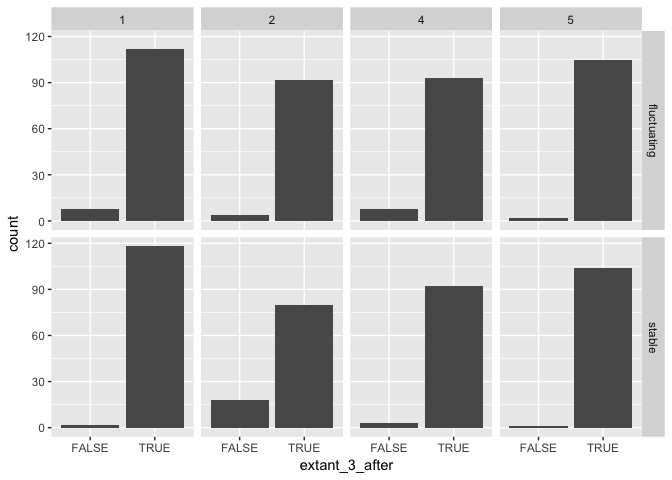
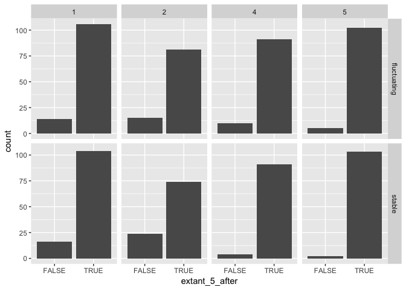
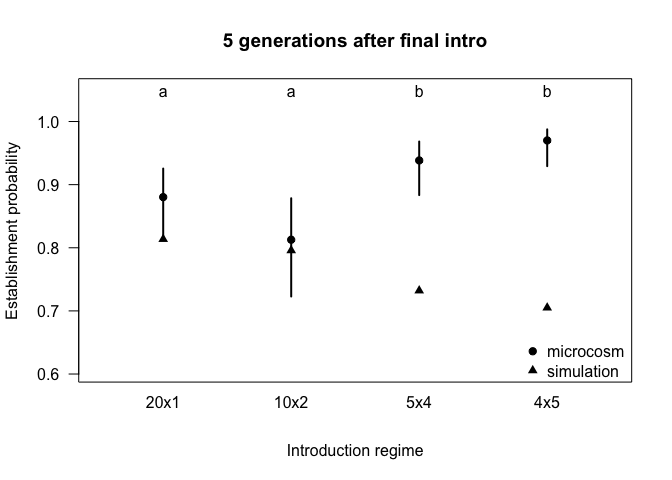
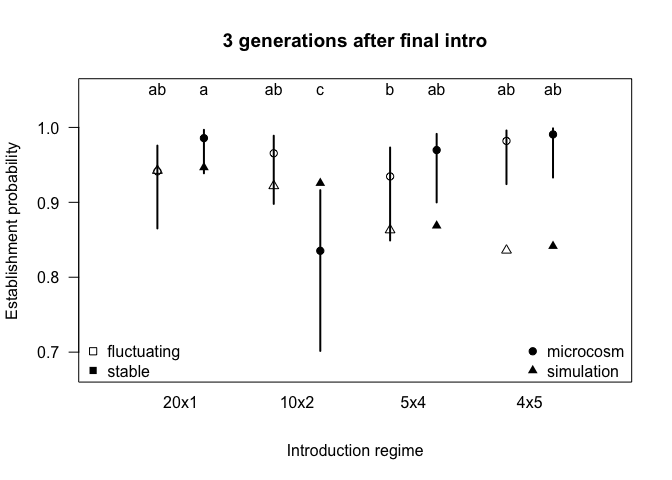
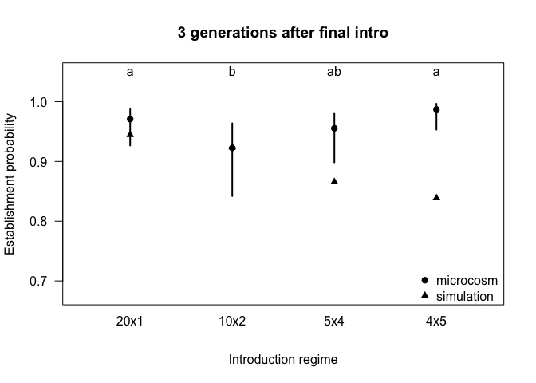

# Purpose

A quick outline of the establishment probability analysis when using a relative amount of time since the final introduction event.


```r
library(car)
library(ggplot2)
library(lme4)
```

```
## Loading required package: Matrix
```

```r
library(lsmeans)
```

```
## The 'lsmeans' package is being deprecated.
## Users are encouraged to switch to 'emmeans'.
## See help('transition') for more information, including how
## to convert 'lsmeans' objects and scripts to work with 'emmeans'.
```

```r
library(multcompView)
library(tidyr)
```

```
## 
## Attaching package: 'tidyr'
```

```
## The following object is masked from 'package:Matrix':
## 
##     expand
```

```r
library(dplyr)
```

```
## 
## Attaching package: 'dplyr'
```

```
## The following object is masked from 'package:car':
## 
##     recode
```

```
## The following objects are masked from 'package:stats':
## 
##     filter, lag
```

```
## The following objects are masked from 'package:base':
## 
##     intersect, setdiff, setequal, union
```

```r
library(here)
```

```
## here() starts at /Users/mikoontz/dev/manuscripts/ppp-establishment
```

```r
b <- read.csv(here::here("/data/clean-establishment-data.csv"))
b$number <- as.factor(b$number)
b$block <- as.factor(b$block)
b$gap <- as.factor(b$gap)
```

Don't bother assessing the effect of the introduction gap, just filter out those populations


```r
b.trim <-
  b %>% 
  filter(gap == FALSE)

glimpse(b.trim)
```

```
## Observations: 842
## Variables: 42
## $ ID               <int> 1, 2, 3, 4, 5, 6, 7, 8, 9, 10, 11, 12, 13, 14...
## $ block            <fct> 1, 1, 1, 1, 1, 1, 1, 1, 1, 1, 1, 1, 1, 1, 1, ...
## $ color            <fct> blue, blue, blue, blue, blue, blue, blue, blu...
## $ number           <fct> 1, 1, 1, 1, 1, 1, 1, 1, 1, 1, 1, 1, 1, 1, 1, ...
## $ size             <int> 20, 20, 20, 20, 20, 20, 20, 20, 20, 20, 20, 2...
## $ environment      <fct> fluctuating, fluctuating, fluctuating, fluctu...
## $ special          <lgl> FALSE, FALSE, FALSE, FALSE, FALSE, FALSE, FAL...
## $ gap              <fct> FALSE, FALSE, FALSE, FALSE, FALSE, FALSE, FAL...
## $ notes            <fct> , , , , , , , , , , , , , , , , , , , , , , , , 
## $ drought          <lgl> FALSE, FALSE, FALSE, TRUE, FALSE, TRUE, FALSE...
## $ N0plus1          <int> 8, 15, 10, 12, 8, 22, 16, 19, 14, 16, 16, 20,...
## $ N1plus1          <int> 19, 29, 16, 29, 17, 15, 49, 17, 27, 33, 48, 6...
## $ N2plus1          <int> 29, 14, 28, 33, 25, 28, 21, 7, 13, 50, 48, 51...
## $ N3plus1          <int> 36, 8, 10, 26, 21, 34, 27, 2, 17, 24, 44, 25,...
## $ N4plus1          <int> 40, 17, 4, 51, 37, 35, 19, 10, 7, 40, 63, 41,...
## $ N5plus1          <int> 79, 4, NA, 117, 44, 83, 40, 16, 29, 57, 90, 4...
## $ N6plus1          <int> 89, 8, NA, 44, 43, 55, 52, 14, 34, 76, 42, 51...
## $ N7plus1          <int> 29, 3, NA, 31, 22, 27, 52, 11, 16, 42, 26, 35...
## $ N8plus1          <int> 37, 9, NA, 47, 26, 31, 29, 19, 17, 20, 25, 30...
## $ N9plus1          <int> 34, 17, NA, 28, 24, 22, 25, 10, 19, 15, 38, 1...
## $ temp.extinctions <int> 0, 0, 0, 0, 0, 0, 0, 0, 0, 0, 0, 0, 0, 0, 0, ...
## $ loss             <int> 0, 0, 0, 0, 0, 0, 0, 0, 0, 0, 0, 0, 0, 0, 0, ...
## $ when.extinct     <int> NA, NA, 6, NA, NA, NA, NA, NA, NA, NA, NA, NA...
## $ extant1          <lgl> TRUE, TRUE, TRUE, TRUE, TRUE, TRUE, TRUE, TRU...
## $ extant2          <lgl> TRUE, TRUE, TRUE, TRUE, TRUE, TRUE, TRUE, TRU...
## $ extant3          <lgl> TRUE, TRUE, TRUE, TRUE, TRUE, TRUE, TRUE, TRU...
## $ extant4          <lgl> TRUE, TRUE, TRUE, TRUE, TRUE, TRUE, TRUE, TRU...
## $ extant5          <lgl> TRUE, TRUE, TRUE, TRUE, TRUE, TRUE, TRUE, TRU...
## $ extant6          <lgl> TRUE, TRUE, FALSE, TRUE, TRUE, TRUE, TRUE, TR...
## $ extant7          <lgl> TRUE, TRUE, FALSE, TRUE, TRUE, TRUE, TRUE, TR...
## $ extant8          <lgl> TRUE, TRUE, FALSE, TRUE, TRUE, TRUE, TRUE, TR...
## $ extant9          <lgl> TRUE, TRUE, FALSE, TRUE, TRUE, TRUE, TRUE, TR...
## $ extant_1_after   <lgl> TRUE, TRUE, TRUE, TRUE, TRUE, TRUE, TRUE, TRU...
## $ extant_2_after   <lgl> TRUE, TRUE, TRUE, TRUE, TRUE, TRUE, TRUE, TRU...
## $ extant_3_after   <lgl> TRUE, TRUE, TRUE, TRUE, TRUE, TRUE, TRUE, TRU...
## $ extant_4_after   <lgl> TRUE, TRUE, TRUE, TRUE, TRUE, TRUE, TRUE, TRU...
## $ extant_5_after   <lgl> TRUE, TRUE, TRUE, TRUE, TRUE, TRUE, TRUE, TRU...
## $ N_1_after        <int> 8, 15, 10, 12, 8, 22, 16, 19, 14, 16, 16, 20,...
## $ N_2_after        <int> 19, 29, 16, 29, 17, 15, 49, 17, 27, 33, 48, 6...
## $ N_3_after        <int> 29, 14, 28, 33, 25, 28, 21, 7, 13, 50, 48, 51...
## $ N_4_after        <int> 36, 8, 10, 26, 21, 34, 27, 2, 17, 24, 44, 25,...
## $ N_5_after        <int> 40, 17, 4, 51, 37, 35, 19, 10, 7, 40, 63, 41,...
```

# Exploratory data analysis plot

Visualize how many populations were extant 3 generations after their final introduction event would get us up to Generation 7 (as we reported in the paper). Looking 5 generations is as far as we can look, given the limits of our data collection.


```r
ggplot(b.trim, aes(x = extant_3_after)) +
  geom_histogram(stat = "count") +
  facet_grid(environment ~ number)
```

```
## Warning: Ignoring unknown parameters: binwidth, bins, pad
```

<!-- -->


```r
ggplot(b.trim, aes(x = extant_5_after)) +
  geom_histogram(stat = "count") +
  facet_grid(environment ~ number)
```

```
## Warning: Ignoring unknown parameters: binwidth, bins, pad
```

<!-- -->


# Get simulation results


```r
#### Read data from the simulations ####
sims_results <- read.csv(here::here("data/simulations/simulation_stats_tidy.csv"), stringsAsFactors = FALSE)
```

# Assessment of establishment at relative time point

We will use a simple random effects structure with temporal block as a random intercept effect

## Five generations after the final introduction event. 

This uses data all the way up through generation 9 (for the 4x5 intro regime, generation 9 represents 5 generations after the final introduction event)


```r
prob_establishment_model <- glmer(extant_5_after ~ number*environment + (1 | block), data=b.trim, family=binomial, control=glmerControl(optimizer="bobyqa"))

Anova(prob_establishment_model)
```

```
## Analysis of Deviance Table (Type II Wald chisquare tests)
## 
## Response: extant_5_after
##                      Chisq Df Pr(>Chisq)    
## number             23.1706  3  3.721e-05 ***
## environment         0.1611  1     0.6882    
## number:environment  5.4934  3     0.1390    
## ---
## Signif. codes:  0 '***' 0.001 '**' 0.01 '*' 0.05 '.' 0.1 ' ' 1
```

```r
m_5after_2 <- update(prob_establishment_model, formula= .~. - number:environment)

anova(prob_establishment_model, m_5after_2)
```

```
## Data: b.trim
## Models:
## m_5after_2: extant_5_after ~ number + environment + (1 | block)
## prob_establishment_model: extant_5_after ~ number * environment + (1 | block)
##                          Df    AIC    BIC  logLik deviance  Chisq Chi Df
## m_5after_2                6 545.46 573.88 -266.73   533.46              
## prob_establishment_model  9 545.62 588.24 -263.81   527.62 5.8463      3
##                          Pr(>Chisq)
## m_5after_2                         
## prob_establishment_model     0.1193
```

We fail to reject the null hypothesis that the model with the `number*environment` interaction equally as likely than the model without it, so we proceed by simplifying the model and dropping the interaction term.

Another way to look at group-level effects like we did with likelihood ratio tests is using a Type II Wald $\chi^2$ test. I think this test is somewhat anti-conservative, but it gives us a good ballpark and corroborates the results from our Likelihood Ratio Test.

Get simulation results averaged across environment treatments:


```r
sims_establish_relative <- sims_results %>%
  mutate(propagule_number = substr(intro_regime, start = nchar(intro_regime), stop = nchar(intro_regime))) %>%
  filter(response == "extant_prop" & time_type == "relative") %>%
  select(propagule_number, env, t_equals_5) %>% # Here is where we average establishment across environment treatment
  rename(establish_prop = t_equals_5) %>% 
  group_by(propagule_number) %>% 
  summarize(establish_prop = mean(establish_prop)) %>% 
  as.data.frame()
```


```r
establishment_results <- lsmeans::lsmeans(prob_establishment_model, pairwise ~ number, adjust="none")
```

```
## NOTE: Results may be misleading due to involvement in interactions
```

```r
establishment_posthoc <- summary(establishment_results$lsmeans)

# Get compact letter display for significant differences across levels
establishment_sig_letters <- lsmeans::cld(establishment_results, Letters = letters, sort = FALSE, adjust = "none")$.group
# Remove white space from significance letters object
establishment_sig_letters <- gsub(establishment_sig_letters, pattern = " ", replacement = "")

establishment_xvals <- 1:4

# Minimum y value of the plot is the lowest possible value that can be plotted (lowest lower CI or 
# lowest result from simulations)
xlim <- range(establishment_xvals) + c(-0.5, 0.5)
min_y <- min(c(plogis(establishment_posthoc$asymp.LCL)), sims_establish_relative$establish_prop)

plot(x = establishment_xvals, y = plogis(establishment_posthoc$lsmean), 
     ylim=c(min_y - 0.1, 1.05), 
     xlim = xlim, 
     las=1, 
     pch = 19,
     xlab = "Introduction regime",
     ylab = "Establishment probability",
     xaxt = "n",
     main = "5 generations after final intro")

axis(side = 1, 
     at = 1:4, 
     labels = c("20x1","10x2","5x4","4x5"), 
     tick = FALSE,
     line = -0.5)

segments(x0 = establishment_xvals, 
         y0 = plogis(establishment_posthoc$asymp.LCL), 
         y1 = plogis(establishment_posthoc$asymp.UCL), 
         lwd = 2)

text(x = establishment_xvals, y = 1.07, labels = establishment_sig_letters, pos = 1)

sims_xvals <- establishment_xvals
#### Add simulation results to the plot ####
points(x = establishment_xvals, y = sims_establish_relative$establish_prop,
       pch = 17)

legend("bottomright",
       inset = c(0, -0.025),
       legend = c("microcosm", "simulation"),
       pch = c(19, 17),
       bty = "n")
```

<!-- -->

# Three generations after final introduction event


```r
prob_establishment_model <- glmer(extant_3_after ~ number*environment + (1 | block), data=b.trim, family=binomial, control=glmerControl(optimizer="bobyqa"))

Anova(prob_establishment_model)
```

```
## Analysis of Deviance Table (Type II Wald chisquare tests)
## 
## Response: extant_3_after
##                      Chisq Df Pr(>Chisq)   
## number             13.3811  3   0.003881 **
## environment         0.0708  1   0.790215   
## number:environment 13.7662  3   0.003241 **
## ---
## Signif. codes:  0 '***' 0.001 '**' 0.01 '*' 0.05 '.' 0.1 ' ' 1
```

### Effect of interaction bw environment/intro regime

```r
m_3after_2 <- update(prob_establishment_model, . ~ . - number:environment)

anova(prob_establishment_model, m_3after_2)
```

```
## Data: b.trim
## Models:
## m_3after_2: extant_3_after ~ number + environment + (1 | block)
## prob_establishment_model: extant_3_after ~ number * environment + (1 | block)
##                          Df    AIC    BIC  logLik deviance  Chisq Chi Df
## m_3after_2                6 341.17 369.58 -164.59   329.17              
## prob_establishment_model  9 330.56 373.18 -156.28   312.56 16.614      3
##                          Pr(>Chisq)    
## m_3after_2                             
## prob_establishment_model  0.0008485 ***
## ---
## Signif. codes:  0 '***' 0.001 '**' 0.01 '*' 0.05 '.' 0.1 ' ' 1
```

It looks like there is a significant interaction between environment and introduction regime now. We won't be averaging our contrasts across the environment treatment this time.

### Main effect of propagule number

```r
m_3after_3 <- update(m_3after_2, . ~ . - number)

anova(m_3after_2, m_3after_3)
```

```
## Data: b.trim
## Models:
## m_3after_3: extant_3_after ~ environment + (1 | block)
## m_3after_2: extant_3_after ~ number + environment + (1 | block)
##            Df    AIC    BIC  logLik deviance  Chisq Chi Df Pr(>Chisq)    
## m_3after_3  3 352.69 366.90 -173.34   346.69                             
## m_3after_2  6 341.17 369.58 -164.59   329.17 17.519      3  0.0005525 ***
## ---
## Signif. codes:  0 '***' 0.001 '**' 0.01 '*' 0.05 '.' 0.1 ' ' 1
```

### Main effect of environment


```r
m_3after_4 <- update(m_3after_2, . ~ . - environment)

anova(m_3after_2, m_3after_4)
```

```
## Data: b.trim
## Models:
## m_3after_4: extant_3_after ~ number + (1 | block)
## m_3after_2: extant_3_after ~ number + environment + (1 | block)
##            Df    AIC    BIC  logLik deviance  Chisq Chi Df Pr(>Chisq)
## m_3after_4  5 339.42 363.10 -164.71   329.42                         
## m_3after_2  6 341.17 369.58 -164.59   329.17 0.2499      1     0.6172
```


```r
sims_establish_relative <- sims_results %>%
  mutate(propagule_number = substr(intro_regime, start = nchar(intro_regime), stop = nchar(intro_regime))) %>%
  filter(response == "extant_prop" & time_type == "relative") %>%
  select(propagule_number, env, t_equals_3) %>% # Here is where we average establishment across environment treatment
  rename(establish_prop = t_equals_3) %>% 
  arrange(propagule_number, env) %>% 
  as.data.frame()
```


```r
establishment_results <- lsmeans::lsmeans(prob_establishment_model, pairwise ~ environment*number, adjust="none")
establishment_posthoc <- summary(establishment_results$lsmeans)

# Get compact letter display for significant differences across levels
establishment_sig_letters <- lsmeans::cld(establishment_results, Letters = letters, sort = FALSE, adjust = "none")$.group
# Remove white space from significance letters object
establishment_sig_letters <- gsub(establishment_sig_letters, pattern = " ", replacement = "")

offset_xvals <- function(x, offset) {
  c(sapply(x, FUN = function(j) c(j - offset, j + offset)))
}

establishment_xvals <- offset_xvals(1:4, 0.2)

# Minimum y value of the plot is the lowest possible value that can be plotted (lowest lower CI or 
# lowest result from simulations)
xlim <- range(establishment_xvals) + c(-0.5, 0.5)

plot(x = establishment_xvals, y = plogis(establishment_posthoc$lsmean), 
     ylim=c(min_y - 0.03, 1.05), 
     xlim = xlim, 
     las=1, 
     pch=c(1, 19),
     xlab = "Introduction regime",
     ylab = "Establishment probability",
     xaxt = "n",
     main = "3 generations after final intro")

axis(side = 1, 
     at = 1:4, 
     labels = c("20x1","10x2","5x4","4x5"), 
     tick = FALSE,
     line = -0.5)

segments(x0 = establishment_xvals, 
         y0 = plogis(establishment_posthoc$asymp.LCL), 
         y1 = plogis(establishment_posthoc$asymp.UCL), 
         lwd = 2)

text(x = establishment_xvals, y = 1.07, labels = establishment_sig_letters, pos = 1)

#### Add simulation results to the plot ####

sims_xvals <- offset_xvals(establishment_xvals, offset = 0.05)

#### Add simulation results to the plot ####
points(x = establishment_xvals[c(1, 3, 5, 7)], y = sims_establish_relative$establish_prop[c(1, 3, 5, 7)],
       pch = 2)

points(x = establishment_xvals[c(2, 4, 6, 8)], y = sims_establish_relative$establish_prop[c(2, 4, 6, 8)],
       pch = 17)

legend("bottomleft",
       inset = c(0, -0.025),
       legend = c("fluctuating", "stable"), 
       pch = c(0, 15),
       bty = "n")

legend("bottomright",
       inset = c(0, -0.025),
       legend = c("microcosm", "simulation"),
       pch = c(19, 17),
       bty = "n")
```

<!-- -->


# No interaction


```r
sims_establish_relative <- sims_results %>%
  mutate(propagule_number = substr(intro_regime, start = nchar(intro_regime), stop = nchar(intro_regime))) %>%
  filter(response == "extant_prop" & time_type == "relative") %>%
  select(propagule_number, env, t_equals_3) %>% # Here is where we average establishment across environment treatment
  rename(establish_prop = t_equals_3) %>% 
  group_by(propagule_number) %>%
  summarize(establish_prop = mean(establish_prop)) %>% 
  as.data.frame()
```


```r
establishment_results <- lsmeans::lsmeans(prob_establishment_model, pairwise ~ number, adjust="none")
```

```
## NOTE: Results may be misleading due to involvement in interactions
```

```r
establishment_posthoc <- summary(establishment_results$lsmeans)

# Get compact letter display for significant differences across levels
establishment_sig_letters <- lsmeans::cld(establishment_results, Letters = letters, sort = FALSE, adjust = "none")$.group
# Remove white space from significance letters object
establishment_sig_letters <- gsub(establishment_sig_letters, pattern = " ", replacement = "")

establishment_xvals <- 1:4

# Minimum y value of the plot is the lowest possible value that can be plotted (lowest lower CI or 
# lowest result from simulations)
xlim <- range(establishment_xvals) + c(-0.5, 0.5)

plot(x = establishment_xvals, y = plogis(establishment_posthoc$lsmean), 
     ylim=c(min_y - 0.03, 1.05), 
     xlim = xlim, 
     las = 1, 
     pch = 19,
     xlab = "Introduction regime",
     ylab = "Establishment probability",
     xaxt = "n",
     main = "3 generations after final intro")

axis(side = 1, 
     at = 1:4, 
     labels = c("20x1","10x2","5x4","4x5"), 
     tick = FALSE,
     line = -0.5)

segments(x0 = establishment_xvals, 
         y0 = plogis(establishment_posthoc$asymp.LCL), 
         y1 = plogis(establishment_posthoc$asymp.UCL), 
         lwd = 2)

text(x = establishment_xvals, y = 1.07, labels = establishment_sig_letters, pos = 1)

#### Add simulation results to the plot ####

sims_xvals <- establishment_xvals

#### Add simulation results to the plot ####
points(x = establishment_xvals, y = sims_establish_relative$establish_prop,
       pch = 17)

legend("bottomright",
       inset = c(0, -0.025),
       legend = c("microcosm", "simulation"),
       pch = c(19, 17),
       bty = "n")
```

<!-- -->

The probability of establishment across introduction regimes when measured 3 generations after final introduction event are...


```r
data.frame(establishment_posthoc$number, plogis(establishment_posthoc$lsmean))
```

```
##   establishment_posthoc.number plogis.establishment_posthoc.lsmean.
## 1                            1                            0.9708018
## 2                            2                            0.9225713
## 3                            4                            0.9553823
## 4                            5                            0.9870090
```

