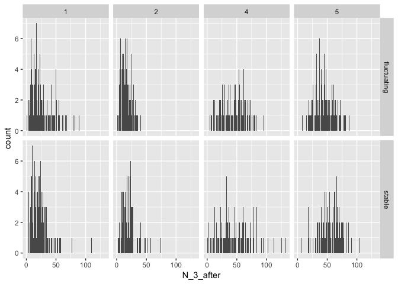
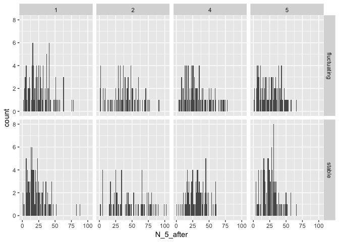
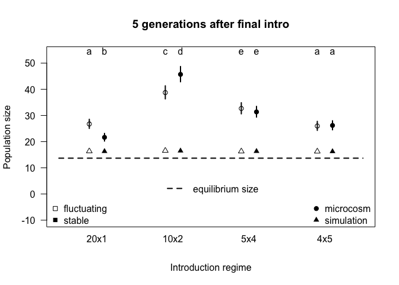
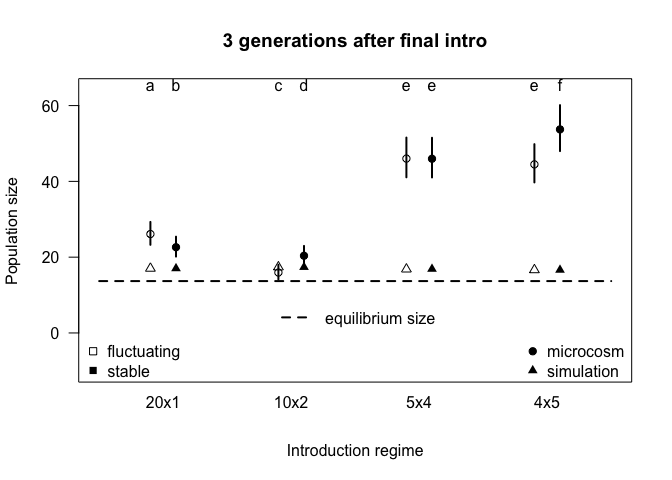

# Purpose

A quick outline of the population size analysis when using a relative amount of time since the final introduction event.


```r
library(car)
library(ggplot2)
library(lme4)
```

```
## Loading required package: Matrix
```

```r
library(lsmeans)
```

```
## The 'lsmeans' package is being deprecated.
## Users are encouraged to switch to 'emmeans'.
## See help('transition') for more information, including how
## to convert 'lsmeans' objects and scripts to work with 'emmeans'.
```

```r
library(multcompView)
library(tidyr)
```

```
## 
## Attaching package: 'tidyr'
```

```
## The following object is masked from 'package:Matrix':
## 
##     expand
```

```r
library(dplyr)
```

```
## 
## Attaching package: 'dplyr'
```

```
## The following object is masked from 'package:car':
## 
##     recode
```

```
## The following objects are masked from 'package:stats':
## 
##     filter, lag
```

```
## The following objects are masked from 'package:base':
## 
##     intersect, setdiff, setequal, union
```

```r
library(here)
```

```
## here() starts at /Users/mikoontz/dev/manuscripts/ppp-establishment
```

```r
b <- read.csv(here::here("/data/clean-establishment-data.csv"))
b$number <- as.factor(b$number)
b$block <- as.factor(b$block)
b$gap <- as.factor(b$gap)
```

Don't bother assessing the effect of the introduction gap, just filter out those populations


```r
b.trim <-
  b %>% 
  filter(gap == FALSE)

glimpse(b.trim)
```

```
## Observations: 842
## Variables: 42
## $ ID               <int> 1, 2, 3, 4, 5, 6, 7, 8, 9, 10, 11, 12, 13, 14...
## $ block            <fct> 1, 1, 1, 1, 1, 1, 1, 1, 1, 1, 1, 1, 1, 1, 1, ...
## $ color            <fct> blue, blue, blue, blue, blue, blue, blue, blu...
## $ number           <fct> 1, 1, 1, 1, 1, 1, 1, 1, 1, 1, 1, 1, 1, 1, 1, ...
## $ size             <int> 20, 20, 20, 20, 20, 20, 20, 20, 20, 20, 20, 2...
## $ environment      <fct> fluctuating, fluctuating, fluctuating, fluctu...
## $ special          <lgl> FALSE, FALSE, FALSE, FALSE, FALSE, FALSE, FAL...
## $ gap              <fct> FALSE, FALSE, FALSE, FALSE, FALSE, FALSE, FAL...
## $ notes            <fct> , , , , , , , , , , , , , , , , , , , , , , , , 
## $ drought          <lgl> FALSE, FALSE, FALSE, TRUE, FALSE, TRUE, FALSE...
## $ N0plus1          <int> 8, 15, 10, 12, 8, 22, 16, 19, 14, 16, 16, 20,...
## $ N1plus1          <int> 19, 29, 16, 29, 17, 15, 49, 17, 27, 33, 48, 6...
## $ N2plus1          <int> 29, 14, 28, 33, 25, 28, 21, 7, 13, 50, 48, 51...
## $ N3plus1          <int> 36, 8, 10, 26, 21, 34, 27, 2, 17, 24, 44, 25,...
## $ N4plus1          <int> 40, 17, 4, 51, 37, 35, 19, 10, 7, 40, 63, 41,...
## $ N5plus1          <int> 79, 4, NA, 117, 44, 83, 40, 16, 29, 57, 90, 4...
## $ N6plus1          <int> 89, 8, NA, 44, 43, 55, 52, 14, 34, 76, 42, 51...
## $ N7plus1          <int> 29, 3, NA, 31, 22, 27, 52, 11, 16, 42, 26, 35...
## $ N8plus1          <int> 37, 9, NA, 47, 26, 31, 29, 19, 17, 20, 25, 30...
## $ N9plus1          <int> 34, 17, NA, 28, 24, 22, 25, 10, 19, 15, 38, 1...
## $ temp.extinctions <int> 0, 0, 0, 0, 0, 0, 0, 0, 0, 0, 0, 0, 0, 0, 0, ...
## $ loss             <int> 0, 0, 0, 0, 0, 0, 0, 0, 0, 0, 0, 0, 0, 0, 0, ...
## $ when.extinct     <int> NA, NA, 6, NA, NA, NA, NA, NA, NA, NA, NA, NA...
## $ extant1          <lgl> TRUE, TRUE, TRUE, TRUE, TRUE, TRUE, TRUE, TRU...
## $ extant2          <lgl> TRUE, TRUE, TRUE, TRUE, TRUE, TRUE, TRUE, TRU...
## $ extant3          <lgl> TRUE, TRUE, TRUE, TRUE, TRUE, TRUE, TRUE, TRU...
## $ extant4          <lgl> TRUE, TRUE, TRUE, TRUE, TRUE, TRUE, TRUE, TRU...
## $ extant5          <lgl> TRUE, TRUE, TRUE, TRUE, TRUE, TRUE, TRUE, TRU...
## $ extant6          <lgl> TRUE, TRUE, FALSE, TRUE, TRUE, TRUE, TRUE, TR...
## $ extant7          <lgl> TRUE, TRUE, FALSE, TRUE, TRUE, TRUE, TRUE, TR...
## $ extant8          <lgl> TRUE, TRUE, FALSE, TRUE, TRUE, TRUE, TRUE, TR...
## $ extant9          <lgl> TRUE, TRUE, FALSE, TRUE, TRUE, TRUE, TRUE, TR...
## $ extant_1_after   <lgl> TRUE, TRUE, TRUE, TRUE, TRUE, TRUE, TRUE, TRU...
## $ extant_2_after   <lgl> TRUE, TRUE, TRUE, TRUE, TRUE, TRUE, TRUE, TRU...
## $ extant_3_after   <lgl> TRUE, TRUE, TRUE, TRUE, TRUE, TRUE, TRUE, TRU...
## $ extant_4_after   <lgl> TRUE, TRUE, TRUE, TRUE, TRUE, TRUE, TRUE, TRU...
## $ extant_5_after   <lgl> TRUE, TRUE, TRUE, TRUE, TRUE, TRUE, TRUE, TRU...
## $ N_1_after        <int> 8, 15, 10, 12, 8, 22, 16, 19, 14, 16, 16, 20,...
## $ N_2_after        <int> 19, 29, 16, 29, 17, 15, 49, 17, 27, 33, 48, 6...
## $ N_3_after        <int> 29, 14, 28, 33, 25, 28, 21, 7, 13, 50, 48, 51...
## $ N_4_after        <int> 36, 8, 10, 26, 21, 34, 27, 2, 17, 24, 44, 25,...
## $ N_5_after        <int> 40, 17, 4, 51, 37, 35, 19, 10, 7, 40, 63, 41,...
```

# Exploratory data analysis plot

Visualize how many populations were extant 2 generations after their final introduction event would get us up to Generation 7 (as we reported in the paper). Looking 5 generations is as far as we can look, given the limits of our data collection.


```r
ggplot(b.trim, aes(x = N_3_after)) +
  geom_histogram(stat = "count") +
  facet_grid(environment ~ number)
```

```
## Warning: Ignoring unknown parameters: binwidth, bins, pad
```

```
## Warning: Removed 46 rows containing non-finite values (stat_count).
```

<!-- -->


```r
ggplot(b.trim, aes(x = N_5_after)) +
  geom_histogram(stat = "count") +
  facet_grid(environment ~ number)
```

```
## Warning: Ignoring unknown parameters: binwidth, bins, pad
```

```
## Warning: Removed 90 rows containing non-finite values (stat_count).
```

<!-- -->


# Build some models

## Five generations after final introduction event

We will use a simple random effects structure with temporal block as a random intercept effect

### Influence of fixed effects


```r
# Use LRT tests to guide interpretation, but all fixed effects will remain in the model in the end
popSize_model <- glmer(N_5_after ~ number*environment + (1 | block), data=b.trim, family=poisson, control=glmerControl(optimizer="bobyqa"))

m7 <- update(popSize_model, formula= .~. - number:environment)

anova(popSize_model, m7)
```

```
## Data: b.trim
## Models:
## m7: N_5_after ~ number + environment + (1 | block)
## popSize_model: N_5_after ~ number * environment + (1 | block)
##               Df   AIC   BIC  logLik deviance  Chisq Chi Df Pr(>Chisq)    
## m7             6 11179 11207 -5583.6    11167                             
## popSize_model  9 11083 11124 -5532.3    11065 102.65      3  < 2.2e-16 ***
## ---
## Signif. codes:  0 '***' 0.001 '**' 0.01 '*' 0.05 '.' 0.1 ' ' 1
```

We reject the null hypothesis that the model with the `number*environment` interaction equally as likely than the model without it, so we keep the interaction term and will base all interpretations without averaging across any treatments.

Another way to look at group-level effects like we did with likelihood ratio tests is using a Type II Wald $\chi^2$ test. I think this test is somewhat anti-conservative, but it gives us a good ballpark and corroborates the results from our Likelihood Ratio Test.


```r
Anova(popSize_model)
```

```
## Analysis of Deviance Table (Type II Wald chisquare tests)
## 
## Response: N_5_after
##                        Chisq Df Pr(>Chisq)    
## number             1079.8507  3     <2e-16 ***
## environment           0.4543  1     0.5003    
## number:environment  102.2882  3     <2e-16 ***
## ---
## Signif. codes:  0 '***' 0.001 '**' 0.01 '*' 0.05 '.' 0.1 ' ' 1
```

### Interpretation and contrasts


```r
#### Read and prepare data from the simulations ####
sims_results <- read.csv(here::here("data/simulations/simulation_stats_tidy.csv"), stringsAsFactors = FALSE)

sims_popSize_relative <- sims_results %>%
  mutate(propagule_number = substr(intro_regime, start = nchar(intro_regime), stop = nchar(intro_regime))) %>%
  filter(response == "mean_N" & time_type == "relative") %>%
  select(propagule_number, env, mean_N = t_equals_5) %>% # Here is where we get the simulation results from GEN 7
  arrange(propagule_number, env)

#### Read samples data to put the equilibrium abundance value on the abundance plot ####
samps <- read.csv(here::here("data/NBBg-samples/NBBg-samples-combined.csv"))
equilibrium_popSize <- log(samps$R0) / samps$alpha

offset_xvals <- function(x, offset) {
  c(sapply(x, FUN = function(j) c(j - offset, j + offset)))
}
```


```r
popSize_results <- lsmeans::lsmeans(popSize_model, pairwise ~ environment + number, adjust="none")
popSize_posthoc <- summary(popSize_results$lsmeans)

popSize_sig_letters <- lsmeans::cld(popSize_results, Letters = letters, sort = FALSE, adjust = "none")$.group
popSize_sig_letters <- gsub(popSize_sig_letters, pattern = " ", replacement = "")
```

Visualize with both the simulation results and microcosm results


```r
popSize_xvals <- offset_xvals(1:4, 0.1)

min_y <- min(c(exp(popSize_posthoc$asymp.LCL), sims_popSize_relative$mean_N))
max_y <- max(exp(popSize_posthoc$asymp.UCL))
xlim <- range(popSize_xvals) + c(-0.4, 0.4)

plot(x = popSize_xvals, y = exp(popSize_posthoc$lsmean),
     type = "n", # Set the plot up, but do not print lines yet
     ylim = c(-10, max_y + 5), 
     xlim = xlim, 
     las = 1, 
     pch = 1, 
     xaxt = "n",
     xlab = "Introduction regime",
     ylab = "Population size",
     main = "5 generations after final intro")

segments(x0 = popSize_xvals, 
         y0 = exp(popSize_posthoc$asymp.LCL), 
         y1 = exp(popSize_posthoc$asymp.UCL), 
         lwd = 2)

points(x = popSize_xvals[c(1, 3, 5, 7)], y = exp(popSize_posthoc$lsmean[c(1, 3, 5, 7)]),
       pch = 1)

points(x = popSize_xvals[c(2, 4, 6, 8)], y = exp(popSize_posthoc$lsmean[c(2, 4, 6, 8)]),
       pch = 19)

axis(side = 1, 
     at = 1:4, 
     labels = c("20x1", "10x2", "5x4", "4x5"), 
     tick = FALSE,
     line = -0.5)

legend("bottomleft",
       inset = c(0, -0.025),
       legend = c("fluctuating", "stable"), 
       pch = c(0, 15),
       bty = "n")

legend("bottom",
       inset = c(0, 0.15),
       legend = "equilibrium size", 
       lty = 2,
       lwd = 2,
       bty = "n")

legend("bottomright",
       inset = c(0, -0.025),
       legend = c("microcosm", "simulation"), 
       pch = c(19, 17),
       bty = "n")

text(x = popSize_xvals, y = max_y + 9, labels = popSize_sig_letters, pos = 1)

sims_xvals <- offset_xvals(popSize_xvals, offset = 0.05)

#### Add simulation results to the plot ####
points(x = popSize_xvals[c(1, 3, 5, 7)], y = sims_popSize_relative$mean_N[c(1, 3, 5, 7)],
       pch = 2)

points(x = popSize_xvals[c(2, 4, 6, 8)], y = sims_popSize_relative$mean_N[c(2, 4, 6, 8)],
       pch = 17)

segments(x0 = xlim[1], x1 = xlim[2], y0 = mean(equilibrium_popSize), y1 = mean(equilibrium_popSize), lty = "dashed", lwd = 2)
```

<!-- -->

## Three generations after final intro event

This analysis will use generation 7 as the latest possible generation (for the 4x5 intro regime, the 7th generation represents 3 generations after the final introduction.)

Get the simulation results we want.


```r
sims_popSize_relative <- sims_results %>%
  mutate(propagule_number = substr(intro_regime, start = nchar(intro_regime), stop = nchar(intro_regime))) %>%
  filter(response == "mean_N" & time_type == "relative") %>%
  select(propagule_number, env, mean_N = t_equals_3) %>% # Here is where we get the simulation results from GEN 7
  arrange(propagule_number, env)
```

Build the model for the microcosm data.


```r
popSize_model <- glmer(N_3_after ~ number*environment + (1 | block), data=b.trim, family=poisson, control=glmerControl(optimizer="bobyqa"))

Anova(popSize_model)
```

```
## Analysis of Deviance Table (Type II Wald chisquare tests)
## 
## Response: N_3_after
##                      Chisq Df Pr(>Chisq)    
## number             3779.23  3  < 2.2e-16 ***
## environment          32.88  1  9.802e-09 ***
## number:environment  134.58  3  < 2.2e-16 ***
## ---
## Signif. codes:  0 '***' 0.001 '**' 0.01 '*' 0.05 '.' 0.1 ' ' 1
```

### Effect of interaction


```r
m_3after_2 <- update(popSize_model, . ~ . - number:environment)

anova(popSize_model, m_3after_2)
```

```
## Data: b.trim
## Models:
## m_3after_2: N_3_after ~ number + environment + (1 | block)
## popSize_model: N_3_after ~ number * environment + (1 | block)
##               Df   AIC   BIC  logLik deviance  Chisq Chi Df Pr(>Chisq)    
## m_3after_2     6 10988 11016 -5487.8    10976                             
## popSize_model  9 10859 10901 -5420.4    10841 134.83      3  < 2.2e-16 ***
## ---
## Signif. codes:  0 '***' 0.001 '**' 0.01 '*' 0.05 '.' 0.1 ' ' 1
```

```r
lsmeans::lsmeans(popSize_model, pairwise ~ environment + number, adjust="none")
```

```
## $lsmeans
##  environment number   lsmean         SE df asymp.LCL asymp.UCL
##  fluctuating 1      3.262066 0.05889456 NA  3.146635  3.377498
##  stable      1      3.119136 0.05917295 NA  3.003159  3.235113
##  fluctuating 2      2.769276 0.06177800 NA  2.648193  2.890358
##  stable      2      3.014357 0.06113124 NA  2.894541  3.134172
##  fluctuating 4      3.829019 0.05802276 NA  3.715296  3.942741
##  stable      4      3.828061 0.05800954 NA  3.714364  3.941757
##  fluctuating 5      3.795134 0.05780332 NA  3.681841  3.908426
##  stable      5      3.983682 0.05751292 NA  3.870959  4.096405
## 
## Results are given on the log (not the response) scale. 
## Confidence level used: 0.95 
## 
## $contrasts
##  contrast                           estimate         SE df z.ratio p.value
##  fluctuating,1 - stable,1       0.1429302709 0.02669504 NA   5.354  <.0001
##  fluctuating,1 - fluctuating,2  0.4927908125 0.03207022 NA  15.366  <.0001
##  fluctuating,1 - stable,2       0.2477099173 0.03077814 NA   8.048  <.0001
##  fluctuating,1 - fluctuating,4 -0.5669522637 0.02407419 NA -23.550  <.0001
##  fluctuating,1 - stable,4      -0.5659944524 0.02397736 NA -23.605  <.0001
##  fluctuating,1 - fluctuating,5 -0.5330671009 0.02346414 NA -22.718  <.0001
##  fluctuating,1 - stable,5      -0.7216153294 0.02273004 NA -31.747  <.0001
##  stable,1 - fluctuating,2       0.3498605416 0.03258108 NA  10.738  <.0001
##  stable,1 - stable,2            0.1047796464 0.03131587 NA   3.346  0.0008
##  stable,1 - fluctuating,4      -0.7098825346 0.02474579 NA -28.687  <.0001
##  stable,1 - stable,4           -0.7089247233 0.02466767 NA -28.739  <.0001
##  stable,1 - fluctuating,5      -0.6759973718 0.02416840 NA -27.970  <.0001
##  stable,1 - stable,5           -0.8645456003 0.02345943 NA -36.853  <.0001
##  fluctuating,2 - stable,2      -0.2450808952 0.03600258 NA  -6.807  <.0001
##  fluctuating,2 - fluctuating,4 -1.0597430762 0.03043173 NA -34.824  <.0001
##  fluctuating,2 - stable,4      -1.0587852649 0.03039060 NA -34.839  <.0001
##  fluctuating,2 - fluctuating,5 -1.0258579134 0.03000551 NA -34.189  <.0001
##  fluctuating,2 - stable,5      -1.2144061419 0.02943604 NA -41.256  <.0001
##  stable,2 - fluctuating,4      -0.8146621810 0.02911762 NA -27.978  <.0001
##  stable,2 - stable,4           -0.8137043697 0.02898771 NA -28.071  <.0001
##  stable,2 - fluctuating,5      -0.7807770182 0.02857846 NA -27.320  <.0001
##  stable,2 - stable,5           -0.9693252467 0.02796713 NA -34.659  <.0001
##  fluctuating,4 - stable,4       0.0009578113 0.02181295 NA   0.044  0.9650
##  fluctuating,4 - fluctuating,5  0.0338851628 0.02128127 NA   1.592  0.1113
##  fluctuating,4 - stable,5      -0.1546630657 0.02048040 NA  -7.552  <.0001
##  stable,4 - fluctuating,5       0.0329273515 0.02105432 NA   1.564  0.1178
##  stable,4 - stable,5           -0.1556208770 0.02020689 NA  -7.701  <.0001
##  fluctuating,5 - stable,5      -0.1885482285 0.01959962 NA  -9.620  <.0001
## 
## Results are given on the log (not the response) scale.
```

### Effect of environment


```r
m_3after_3 <- update(m_3after_2, . ~ . - environment)
anova(m_3after_2, m_3after_3)
```

```
## Data: b.trim
## Models:
## m_3after_3: N_3_after ~ number + (1 | block)
## m_3after_2: N_3_after ~ number + environment + (1 | block)
##            Df   AIC   BIC  logLik deviance  Chisq Chi Df Pr(>Chisq)    
## m_3after_3  5 11019 11042 -5504.4    11009                             
## m_3after_2  6 10988 11016 -5487.8    10976 33.178      1  8.411e-09 ***
## ---
## Signif. codes:  0 '***' 0.001 '**' 0.01 '*' 0.05 '.' 0.1 ' ' 1
```

```r
lsmeans::lsmeans(popSize_model, pairwise ~ environment, adjust="none")
```

```
## NOTE: Results may be misleading due to involvement in interactions
```

```
## $lsmeans
##  environment   lsmean         SE df asymp.LCL asymp.UCL
##  fluctuating 3.413874 0.05675268 NA  3.302640  3.525107
##  stable      3.486309 0.05672023 NA  3.375139  3.597478
## 
## Results are averaged over the levels of: number 
## Results are given on the log (not the response) scale. 
## Confidence level used: 0.95 
## 
## $contrasts
##  contrast                estimate         SE df z.ratio p.value
##  fluctuating - stable -0.07243526 0.01340417 NA  -5.404  <.0001
## 
## Results are averaged over the levels of: number 
## Results are given on the log (not the response) scale.
```


### Effect of introduction regime


```r
m_3after_4 <- update(m_3after_2, . ~ . - number)
anova(m_3after_2, m_3after_4)
```

```
## Data: b.trim
## Models:
## m_3after_4: N_3_after ~ environment + (1 | block)
## m_3after_2: N_3_after ~ number + environment + (1 | block)
##            Df   AIC   BIC  logLik deviance  Chisq Chi Df Pr(>Chisq)    
## m_3after_4  3 15176 15190 -7585.2    15170                             
## m_3after_2  6 10988 11016 -5487.8    10976 4194.8      3  < 2.2e-16 ***
## ---
## Signif. codes:  0 '***' 0.001 '**' 0.01 '*' 0.05 '.' 0.1 ' ' 1
```

```r
lsmeans::lsmeans(popSize_model, pairwise ~ number, adjust="none")
```

```
## NOTE: Results may be misleading due to involvement in interactions
```

```
## $lsmeans
##  number   lsmean         SE df asymp.LCL asymp.UCL
##  1      3.190601 0.05750519 NA  3.077893  3.303309
##  2      2.891816 0.05875992 NA  2.776649  3.006983
##  4      3.828540 0.05698177 NA  3.716858  3.940222
##  5      3.889408 0.05681939 NA  3.778044  4.000772
## 
## Results are averaged over the levels of: environment 
## Results are given on the log (not the response) scale. 
## Confidence level used: 0.95 
## 
## $contrasts
##  contrast    estimate         SE df z.ratio p.value
##  1 - 2     0.29878523 0.02241201 NA  13.331  <.0001
##  1 - 4    -0.63793849 0.01722569 NA -37.034  <.0001
##  1 - 5    -0.69880635 0.01662007 NA -42.046  <.0001
##  2 - 4    -0.93672372 0.02101078 NA -44.583  <.0001
##  2 - 5    -0.99759158 0.02052662 NA -48.600  <.0001
##  4 - 5    -0.06086786 0.01469687 NA  -4.142  <.0001
## 
## Results are averaged over the levels of: environment 
## Results are given on the log (not the response) scale.
```


```r
popSize_results <- lsmeans::lsmeans(popSize_model, pairwise ~ environment + number, adjust="none")
popSize_posthoc <- summary(popSize_results$lsmeans)

popSize_sig_letters <- lsmeans::cld(popSize_results, Letters = letters, sort = FALSE, adjust = "none")$.group
popSize_sig_letters <- gsub(popSize_sig_letters, pattern = " ", replacement = "")

popSize_xvals <- offset_xvals(1:4, 0.1)

min_y <- min(c(exp(popSize_posthoc$asymp.LCL), sims_popSize_relative$mean_N))
max_y <- max(exp(popSize_posthoc$asymp.UCL))
xlim <- range(popSize_xvals) + c(-0.4, 0.4)

plot(x = popSize_xvals, y = exp(popSize_posthoc$lsmean),
     type = "n", # Set the plot up, but do not print lines yet
     ylim = c(-10, max_y + 4), 
     xlim = xlim, 
     las = 1, 
     pch = 1, 
     xaxt = "n",
     xlab = "Introduction regime",
     ylab = "Population size",
     main = "3 generations after final intro")

segments(x0 = popSize_xvals, 
         y0 = exp(popSize_posthoc$asymp.LCL), 
         y1 = exp(popSize_posthoc$asymp.UCL), 
         lwd = 2)

points(x = popSize_xvals[c(1, 3, 5, 7)], y = exp(popSize_posthoc$lsmean[c(1, 3, 5, 7)]),
       pch = 1)

points(x = popSize_xvals[c(2, 4, 6, 8)], y = exp(popSize_posthoc$lsmean[c(2, 4, 6, 8)]),
       pch = 19)

axis(side = 1, 
     at = 1:4, 
     labels = c("20x1", "10x2", "5x4", "4x5"), 
     tick = FALSE,
     line = -0.5)

legend("bottomleft",
       inset = c(0, -0.025),
       legend = c("fluctuating", "stable"), 
       pch = c(0, 15),
       bty = "n")

legend("bottom",
       inset = c(0, 0.15),
       legend = "equilibrium size", 
       lty = 2,
       lwd = 2,
       bty = "n")

legend("bottomright",
       inset = c(0, -0.025),
       legend = c("microcosm", "simulation"), 
       pch = c(19, 17),
       bty = "n")

text(x = popSize_xvals, y = max_y + 9, labels = popSize_sig_letters, pos = 1)

sims_xvals <- offset_xvals(popSize_xvals, offset = 0.05)

#### Add simulation results to the plot ####
points(x = popSize_xvals[c(1, 3, 5, 7)], y = sims_popSize_relative$mean_N[c(1, 3, 5, 7)],
       pch = 2)

points(x = popSize_xvals[c(2, 4, 6, 8)], y = sims_popSize_relative$mean_N[c(2, 4, 6, 8)],
       pch = 17)

segments(x0 = xlim[1], x1 = xlim[2], y0 = mean(equilibrium_popSize), y1 = mean(equilibrium_popSize), lty = "dashed", lwd = 2)
```

<!-- -->
