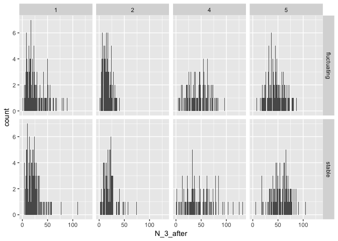
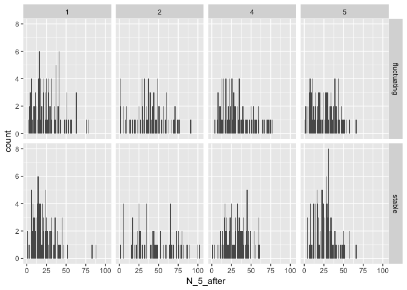
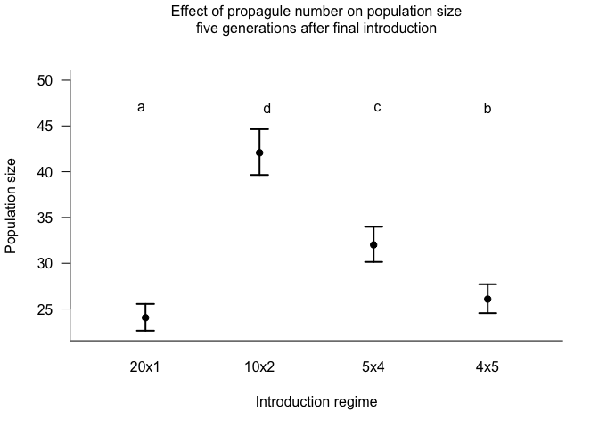
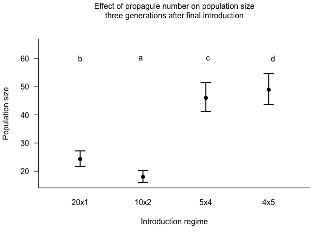
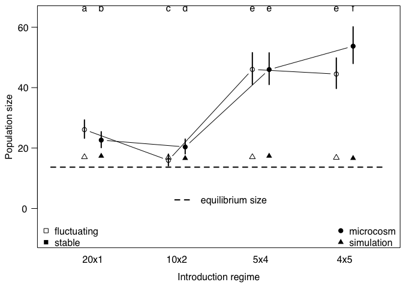

Population size relative time
================
Michael Koontz
2/26/2018

# Purpose

A quick outline of the population size analysis when using a relative
amount of time since the final introduction event.

``` r
library(car)
library(ggplot2)
library(lme4)
```

    ## Loading required package: Matrix

``` r
library(lsmeans)
```

    ## The 'lsmeans' package is being deprecated.
    ## Users are encouraged to switch to 'emmeans'.
    ## See help('transition') for more information, including how
    ## to convert 'lsmeans' objects and scripts to work with 'emmeans'.

``` r
library(multcompView)
library(tidyr)
```

    ## 
    ## Attaching package: 'tidyr'

    ## The following object is masked from 'package:Matrix':
    ## 
    ##     expand

``` r
library(dplyr)
```

    ## 
    ## Attaching package: 'dplyr'

    ## The following object is masked from 'package:car':
    ## 
    ##     recode

    ## The following objects are masked from 'package:stats':
    ## 
    ##     filter, lag

    ## The following objects are masked from 'package:base':
    ## 
    ##     intersect, setdiff, setequal, union

``` r
library(here)
```

    ## here() starts at /Users/mikoontz/dev/manuscripts/ppp-establishment

``` r
b <- read.csv(here::here("/data/clean-establishment-data.csv"))
b$number <- as.factor(b$number)
b$block <- as.factor(b$block)
b$gap <- as.factor(b$gap)
```

Don’t bother assessing the effect of the introduction gap, just filter
out those populations

``` r
b <-
  b %>% 
  filter(gap == FALSE)

glimpse(b)
```

    ## Observations: 842
    ## Variables: 42
    ## $ ID               <int> 1, 2, 3, 4, 5, 6, 7, 8, 9, 10, 11, 12, 13, 14...
    ## $ block            <fct> 1, 1, 1, 1, 1, 1, 1, 1, 1, 1, 1, 1, 1, 1, 1, ...
    ## $ color            <fct> blue, blue, blue, blue, blue, blue, blue, blu...
    ## $ number           <fct> 1, 1, 1, 1, 1, 1, 1, 1, 1, 1, 1, 1, 1, 1, 1, ...
    ## $ size             <int> 20, 20, 20, 20, 20, 20, 20, 20, 20, 20, 20, 2...
    ## $ environment      <fct> fluctuating, fluctuating, fluctuating, fluctu...
    ## $ special          <lgl> FALSE, FALSE, FALSE, FALSE, FALSE, FALSE, FAL...
    ## $ gap              <fct> FALSE, FALSE, FALSE, FALSE, FALSE, FALSE, FAL...
    ## $ notes            <fct> , , , , , , , , , , , , , , , , , , , , , , , , 
    ## $ drought          <lgl> FALSE, FALSE, FALSE, TRUE, FALSE, TRUE, FALSE...
    ## $ N0plus1          <int> 8, 15, 10, 12, 8, 22, 16, 19, 14, 16, 16, 20,...
    ## $ N1plus1          <int> 19, 29, 16, 29, 17, 15, 49, 17, 27, 33, 48, 6...
    ## $ N2plus1          <int> 29, 14, 28, 33, 25, 28, 21, 7, 13, 50, 48, 51...
    ## $ N3plus1          <int> 36, 8, 10, 26, 21, 34, 27, 2, 17, 24, 44, 25,...
    ## $ N4plus1          <int> 40, 17, 4, 51, 37, 35, 19, 10, 7, 40, 63, 41,...
    ## $ N5plus1          <int> 79, 4, NA, 117, 44, 83, 40, 16, 29, 57, 90, 4...
    ## $ N6plus1          <int> 89, 8, NA, 44, 43, 55, 52, 14, 34, 76, 42, 51...
    ## $ N7plus1          <int> 29, 3, NA, 31, 22, 27, 52, 11, 16, 42, 26, 35...
    ## $ N8plus1          <int> 37, 9, NA, 47, 26, 31, 29, 19, 17, 20, 25, 30...
    ## $ N9plus1          <int> 34, 17, NA, 28, 24, 22, 25, 10, 19, 15, 38, 1...
    ## $ temp.extinctions <int> 0, 0, 0, 0, 0, 0, 0, 0, 0, 0, 0, 0, 0, 0, 0, ...
    ## $ loss             <int> 0, 0, 0, 0, 0, 0, 0, 0, 0, 0, 0, 0, 0, 0, 0, ...
    ## $ when.extinct     <int> NA, NA, 6, NA, NA, NA, NA, NA, NA, NA, NA, NA...
    ## $ extant1          <lgl> TRUE, TRUE, TRUE, TRUE, TRUE, TRUE, TRUE, TRU...
    ## $ extant2          <lgl> TRUE, TRUE, TRUE, TRUE, TRUE, TRUE, TRUE, TRU...
    ## $ extant3          <lgl> TRUE, TRUE, TRUE, TRUE, TRUE, TRUE, TRUE, TRU...
    ## $ extant4          <lgl> TRUE, TRUE, TRUE, TRUE, TRUE, TRUE, TRUE, TRU...
    ## $ extant5          <lgl> TRUE, TRUE, TRUE, TRUE, TRUE, TRUE, TRUE, TRU...
    ## $ extant6          <lgl> TRUE, TRUE, FALSE, TRUE, TRUE, TRUE, TRUE, TR...
    ## $ extant7          <lgl> TRUE, TRUE, FALSE, TRUE, TRUE, TRUE, TRUE, TR...
    ## $ extant8          <lgl> TRUE, TRUE, FALSE, TRUE, TRUE, TRUE, TRUE, TR...
    ## $ extant9          <lgl> TRUE, TRUE, FALSE, TRUE, TRUE, TRUE, TRUE, TR...
    ## $ extant_1_after   <lgl> TRUE, TRUE, TRUE, TRUE, TRUE, TRUE, TRUE, TRU...
    ## $ extant_2_after   <lgl> TRUE, TRUE, TRUE, TRUE, TRUE, TRUE, TRUE, TRU...
    ## $ extant_3_after   <lgl> TRUE, TRUE, TRUE, TRUE, TRUE, TRUE, TRUE, TRU...
    ## $ extant_4_after   <lgl> TRUE, TRUE, TRUE, TRUE, TRUE, TRUE, TRUE, TRU...
    ## $ extant_5_after   <lgl> TRUE, TRUE, TRUE, TRUE, TRUE, TRUE, TRUE, TRU...
    ## $ N_1_after        <int> 8, 15, 10, 12, 8, 22, 16, 19, 14, 16, 16, 20,...
    ## $ N_2_after        <int> 19, 29, 16, 29, 17, 15, 49, 17, 27, 33, 48, 6...
    ## $ N_3_after        <int> 29, 14, 28, 33, 25, 28, 21, 7, 13, 50, 48, 51...
    ## $ N_4_after        <int> 36, 8, 10, 26, 21, 34, 27, 2, 17, 24, 44, 25,...
    ## $ N_5_after        <int> 40, 17, 4, 51, 37, 35, 19, 10, 7, 40, 63, 41,...

# Exploratory data analysis plot

Visualize how many populations were extant 2 generations after their
final introduction event would get us up to Generation 7 (as we reported
in the paper). Looking 5 generations is as far as we can look, given the
limits of our data collection.

``` r
ggplot(b, aes(x = N_3_after)) +
  geom_histogram(stat = "count") +
  facet_grid(environment ~ number)
```

    ## Warning: Ignoring unknown parameters: binwidth, bins, pad

    ## Warning: Removed 46 rows containing non-finite values (stat_count).

<!-- -->

``` r
ggplot(b, aes(x = N_5_after)) +
  geom_histogram(stat = "count") +
  facet_grid(environment ~ number)
```

    ## Warning: Ignoring unknown parameters: binwidth, bins, pad

    ## Warning: Removed 90 rows containing non-finite values (stat_count).

<!-- -->

# Build some models

## Five generations after final introduction event

We will use a simple random effects structure with temporal block as a
random intercept
effect

### Influence of fixed effects

``` r
# Use LRT tests to guide interpretation, but all fixed effects will remain in the model in the end
m6 <- glmer(N_5_after ~ number*environment + (1 | block), data=b, family=poisson, control=glmerControl(optimizer="bobyqa"))

m7 <- update(m6, formula= .~. - number:environment)

anova(m6, m7)
```

    ## Data: b
    ## Models:
    ## m7: N_5_after ~ number + environment + (1 | block)
    ## m6: N_5_after ~ number * environment + (1 | block)
    ##    Df   AIC   BIC  logLik deviance  Chisq Chi Df Pr(>Chisq)    
    ## m7  6 11179 11207 -5583.6    11167                             
    ## m6  9 11083 11124 -5532.3    11065 102.65      3  < 2.2e-16 ***
    ## ---
    ## Signif. codes:  0 '***' 0.001 '**' 0.01 '*' 0.05 '.' 0.1 ' ' 1

We reject the null hypothesis that the model with the
`number*environment` interaction equally as likely than the model
without it, so we keep the interaction term and will base all
interpretations without averaging across any treatments.

Another way to look at group-level effects like we did with likelihood
ratio tests is using a Type II Wald \(\chi^2\) test. I think this test
is somewhat anti-conservative, but it gives us a good ballpark and
corroborates the results from our Likelihood Ratio Test.

``` r
Anova(m6)
```

    ## Analysis of Deviance Table (Type II Wald chisquare tests)
    ## 
    ## Response: N_5_after
    ##                        Chisq Df Pr(>Chisq)    
    ## number             1079.8507  3     <2e-16 ***
    ## environment           0.4543  1     0.5003    
    ## number:environment  102.2882  3     <2e-16 ***
    ## ---
    ## Signif. codes:  0 '***' 0.001 '**' 0.01 '*' 0.05 '.' 0.1 ' ' 1

### Interpretation and contrasts

We’ll average across the environment treatments and focus on the
introduction regime
treatments.

``` r
# The final model which includes all fixed effects and uses the trimmed dataset without populations that experienced a gap in the introduction period
final <- m6

results <- lsmeans::lsmeans(final, pairwise ~ number, adjust="none")
```

    ## NOTE: Results may be misleading due to involvement in interactions

``` r
results
```

    ## $lsmeans
    ##  number   lsmean         SE df asymp.LCL asymp.UCL
    ##  1      3.180125 0.03101280 NA  3.119341  3.240909
    ##  2      3.739392 0.03029245 NA  3.680020  3.798764
    ##  4      3.465949 0.03059133 NA  3.405991  3.525907
    ##  5      3.261149 0.03085477 NA  3.200675  3.321624
    ## 
    ## Results are averaged over the levels of: environment 
    ## Results are given on the log (not the response) scale. 
    ## Confidence level used: 0.95 
    ## 
    ## $contrasts
    ##  contrast    estimate         SE df z.ratio p.value
    ##  1 - 2    -0.55926707 0.01882916 NA -29.702  <.0001
    ##  1 - 4    -0.28582434 0.01931251 NA -14.800  <.0001
    ##  1 - 5    -0.08102447 0.01970796 NA  -4.111  <.0001
    ##  2 - 4     0.27344273 0.01808779 NA  15.118  <.0001
    ##  2 - 5     0.47824260 0.01850401 NA  25.845  <.0001
    ##  4 - 5     0.20479987 0.01901041 NA  10.773  <.0001
    ## 
    ## Results are averaged over the levels of: environment 
    ## Results are given on the log (not the response) scale.

``` r
posthoc <- summary(results$lsmeans)

sig_letters <- lsmeans::cld(results, Letters = letters, adjust = "none")$.group[order(cld(results)$number)]
xvals <- 1:length(posthoc$lsmean)
min_y <- min(exp(posthoc$asymp.LCL))

plot(x = xvals, y = exp(posthoc$lsmean), 
     ylim=c(min_y, 50.0), 
     xlim = range(xvals) + c(-0.5, 0.5), 
     las=1, 
     pch=19, 
     xaxt="n", 
     xlab="Introduction regime", 
     ylab="Population size",
     bty="L")

axis(side=1, 
     at = xvals, 
     labels = c("20x1","10x2","5x4","4x5"), 
     tick = FALSE)

arrows(x0 = xvals, 
       y0 = exp(posthoc$asymp.LCL), 
       y1 = exp(posthoc$asymp.UCL), 
       code = 3, 
       length = 0.1, 
       angle = 90, 
       lwd = 2)

text(x = 1:4, y = 47.0, labels = sig_letters)

mtext(side=3, 
      text="Effect of propagule number on population size\nfive generations after final introduction", 
      line = 2)
```

<!-- -->

## Three generations after final intro event

This analysis will use generation 7 as the latest possible generation
(for the 4x5 intro regime, the 7th generation represents 3 generations
after the final
introduction.)

``` r
final_3after <- glmer(N_3_after ~ number*environment + (1 | block), data=b, family=poisson, control=glmerControl(optimizer="bobyqa"))

Anova(final_3after)
```

    ## Analysis of Deviance Table (Type II Wald chisquare tests)
    ## 
    ## Response: N_3_after
    ##                      Chisq Df Pr(>Chisq)    
    ## number             3779.23  3  < 2.2e-16 ***
    ## environment          32.88  1  9.802e-09 ***
    ## number:environment  134.58  3  < 2.2e-16 ***
    ## ---
    ## Signif. codes:  0 '***' 0.001 '**' 0.01 '*' 0.05 '.' 0.1 ' ' 1

We still find that number of introductions is the only important
predictor. Let’s
plot:

``` r
results_3after <- lsmeans::lsmeans(final_3after, pairwise ~ number, adjust="none")
```

    ## NOTE: Results may be misleading due to involvement in interactions

``` r
results_3after
```

    ## $lsmeans
    ##  number   lsmean         SE df asymp.LCL asymp.UCL
    ##  1      3.190601 0.05750519 NA  3.077893  3.303309
    ##  2      2.891816 0.05875992 NA  2.776649  3.006983
    ##  4      3.828540 0.05698177 NA  3.716858  3.940222
    ##  5      3.889408 0.05681939 NA  3.778044  4.000772
    ## 
    ## Results are averaged over the levels of: environment 
    ## Results are given on the log (not the response) scale. 
    ## Confidence level used: 0.95 
    ## 
    ## $contrasts
    ##  contrast    estimate         SE df z.ratio p.value
    ##  1 - 2     0.29878523 0.02241201 NA  13.331  <.0001
    ##  1 - 4    -0.63793849 0.01722569 NA -37.034  <.0001
    ##  1 - 5    -0.69880635 0.01662007 NA -42.046  <.0001
    ##  2 - 4    -0.93672372 0.02101078 NA -44.583  <.0001
    ##  2 - 5    -0.99759158 0.02052662 NA -48.600  <.0001
    ##  4 - 5    -0.06086786 0.01469687 NA  -4.142  <.0001
    ## 
    ## Results are averaged over the levels of: environment 
    ## Results are given on the log (not the response) scale.

``` r
posthoc_3after <- summary(results_3after$lsmeans)

sig_letters_3after <- lsmeans::cld(results_3after, Letters = letters, adjust = "none")$.group[order(cld(results_3after)$number)]

xvals_3after <- 1:length(posthoc_3after$lsmean)
min_y_3after <- min(exp(posthoc_3after$asymp.LCL))

plot(x = xvals_3after, y = exp(posthoc_3after$lsmean), 
     ylim=c(min_y_3after, 65.0), 
     xlim = range(xvals_3after) + c(-0.5, 0.5), 
     las=1, 
     pch=19, 
     xaxt="n", 
     xlab="Introduction regime", 
     ylab="Population size",
     bty="L")

axis(side=1, 
     at = xvals_3after, 
     labels = c("20x1","10x2","5x4","4x5"), 
     tick = FALSE)

arrows(x0 = xvals_3after, 
       y0 = exp(posthoc_3after$asymp.LCL), 
       y1 = exp(posthoc_3after$asymp.UCL), 
       code = 3, 
       length = 0.1, 
       angle = 90, 
       lwd = 2)

text(x = 1:4, y = 60.0, labels = sig_letters_3after)

mtext(side=3, 
      text="Effect of propagule number on population size\nthree generations after final introduction", 
      line = 2)
```

<!-- -->

# Simulation results

``` r
#### Read and prepare data from the simulations ####
sims_results_raw <- read.csv(here::here("data/simulations/simulation_stats_raw.csv"), stringsAsFactors = FALSE)
```

    ## Warning in read.table(file = file, header = header, sep = sep, quote
    ## = quote, : incomplete final line found by readTableHeader on '/
    ## Users/mikoontz/dev/manuscripts/ppp-establishment/data/simulations/
    ## simulation_stats_raw.csv'

``` r
sims_results_3after <- 
  sims_results_raw %>% 
  select(size, number, extant_prop_3after, extant_prop_3after_var, N_3after, N_3after_var)
```

``` r
# Do not average over the environment treatments because there is a significant effect of environment on mean abundance
sims_popSize <- 
  sims_results_3after %>%
  select(size, number, N_3after, N_3after_var) %>% 
  gather(key = env, value = mean_N, -(1:2)) %>% 
  mutate(env = ifelse(env == "N_3after", yes = "stable", no = "fluctuating")) %>% 
  mutate(intro_regime = paste(size, number, sep = "x"))


#### Read samples data to put the equilibrium abundance value on the abundance plot ####
samps <- read.csv(here::here("data/NBBg-samples/NBBg-samples-combined.csv"))

equilibrium_popSize <- log(samps$R0) / samps$alpha
```

# Plot again with simulation results

``` r
popSize_model <- glmer(N_3_after ~ number*environment + (1 | block), data=b, family=poisson, control=glmerControl(optimizer="bobyqa"))

popSize_results <- lsmeans::lsmeans(popSize_model, pairwise ~ environment + number, adjust="none")
popSize_posthoc <- summary(popSize_results$lsmeans)

popSize_sig_letters <- lsmeans::cld(popSize_results, Letters = letters, sort = FALSE, adjust = "none")$.group
popSize_sig_letters <- gsub(popSize_sig_letters, pattern = " ", replacement = "")

offset_xvals <- function(x, offset) {
  c(sapply(x, FUN = function(j) c(j - offset, j + offset)))
}
popSize_xvals <- offset_xvals(1:4, 0.1)

min_y <- min(c(exp(popSize_posthoc$asymp.LCL), sims_popSize$mean_N))
max_y <- max(exp(popSize_posthoc$asymp.UCL))
xlim <- range(popSize_xvals) + c(-0.4, 0.4)

# pdf("figures/population-size-experiment-and-simulations.pdf", height = 3.14961, width = 3.14961)
par(mar = c(3.5, 3.25, 0.5, 0.25), family = "Helvetica", mgp = c(2.0, 1, 0))

plot(x = popSize_xvals, y = exp(popSize_posthoc$lsmean),
     type = "n", # Set the plot up, but do not print lines yet
     ylim = c(-10, max_y + 4), 
     xlim = xlim, 
     las = 1, 
     pch = 1, 
     xaxt = "n",
     yaxt = "n",
     xlab = NA, 
     ylab = "Population size")

mtext(side = 1,
      text = "Introduction regime",
      line = 2)

segments(x0 = popSize_xvals, 
         y0 = exp(popSize_posthoc$asymp.LCL), 
         y1 = exp(popSize_posthoc$asymp.UCL), 
         lwd = 2)

points(x = popSize_xvals[c(1, 3, 5, 7)], y = exp(popSize_posthoc$lsmean[c(1, 3, 5, 7)]),
       pch = 1,
       type = "b")

points(x = popSize_xvals[c(2, 4, 6, 8)], y = exp(popSize_posthoc$lsmean[c(2, 4, 6, 8)]),
     pch = 19,
     type = "b")

axis(side = 1, 
     at = 1:4, 
     labels = c("20x1", "10x2", "5x4", "4x5"), 
     tick = FALSE,
     line = -0.5)

axis(side = 2,
     at = seq(0, 60, by = 20),
     las = 1,
     hadj = 0.75)

legend("bottomleft",
       inset = c(0, -0.025),
       legend = c("fluctuating", "stable"), 
       pch = c(0, 15),
       bty = "n")

legend("bottom",
       inset = c(0, 0.15),
       legend = "equilibrium size", 
       lty = 2,
       lwd = 2,
       bty = "n")

legend("bottomright",
       inset = c(0, -0.025),
       legend = c("microcosm", "simulation"), 
       pch = c(19, 17),
       bty = "n")

text(x = popSize_xvals, y = max_y + 9, labels = popSize_sig_letters, pos = 1)

sims_xvals <- offset_xvals(popSize_xvals, offset = 0.05)
#### Add simulation results to the plot ####
# segments(x0 = sims_xvals[seq(1, length(sims_xvals), by = 2)], x1 = sims_xvals[seq(2, length(sims_xvals), by = 2)], y0 = sims_popSize$mean_N, lwd = 4)

points(x = popSize_xvals[c(1, 3, 5, 7)], y = sims_popSize$mean_N[c(1, 3, 5, 7)],
       pch = 2)

points(x = popSize_xvals[c(2, 4, 6, 8)], y = sims_popSize$mean_N[c(2, 4, 6, 8)],
       pch = 17)

segments(x0 = xlim[1], x1 = xlim[2], y0 = mean(equilibrium_popSize), y1 = mean(equilibrium_popSize), lty = "dashed", lwd = 2)
```

<!-- -->

``` r
# dev.off()
```
